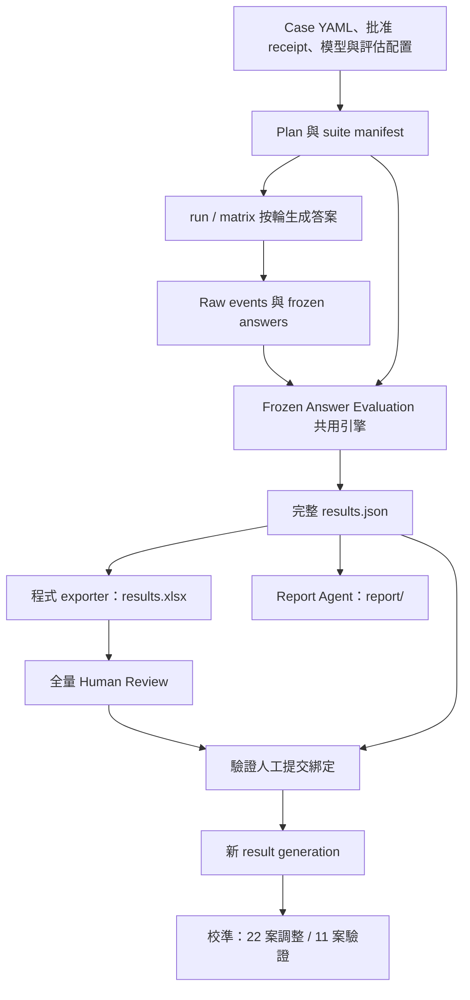

# XiaoAn Evaluation｜凍結答案評估：流程、數據、指標與使用指南

**現況版本：2026-09-26 · 評估政策 `frozen-answer/v2` · 結果契約 `xiaoan-results/v2` · 案例集 Minimal33（33 案／100 輪）**

這套框架回答四件事：

1. **XiaoAn（或某個模型）這一輪回答了什麼**，生成時看到了什麼 context、走了哪條路由；
2. **每位 Judge 怎樣評這份回答**：七維 rubric、紅線、逐 claim 的支持與正確性、核准要求是否滿足；
3. **結果有多可信**：每個數字的分子、分母、覆蓋率、缺失原因與 Judge 間分歧；
4. **人怎樣逐條審核並校準 Judge**，以及下一個產品修改應在哪裡驗證。

本文件是**使用與閱讀入口**；公式、狀態語義、聚合規則與校準協議的完整契約見 [METHODOLOGY.md](METHODOLOGY.md)。文中程式 key／enum 保留原拼寫，敘述使用繁體中文。

> **2026-09-24～26 重構摘要（相對 2026-09-23 版本的破壞性變更）**
>
> - 唯一正式評估入口為 `measure frozen-answer-evaluation`；`measure unified`、`measure staged`、舊 workbook 報告入口已移除，不保留 alias 或舊格式輸出。
> - `run`（部署回歸）與 `matrix`（多 subject）只負責**生成並凍結答案**，評估一律交給同一個共用引擎。
> - **紅線不再把 rubric 歸零**：紅線獨立驅動 gate（PASS／FAIL／UNDETERMINED／NOT_APPLICABLE），rubric 七維照常完成評分。
> - **各 Judge 分開展示**：不計跨 Judge 平均、投票或唯一排名；取消自評隔離（self-judging／same-family）欄位，保留模型身分。
> - 舊的一般 Judge `faithfulness_claims` 與獨立 Attribution Judge 已移除，改為「一次抽取 claims → 每位 Judge 同次評 faithfulness／correctness／requirements」。
> - 正式產物為完整 `results.json`＋由程式投影的 `results.xlsx`（12 張表）＋獨立 Report Agent 的 `report/`。
> - 每次自動交付後進行**全量人工審閱**（每個 answer × Judge），人工修訂產生新的 result generation；Judge 校準按 case 22／11 切分。

## 程式位置與本 repo 的關係

新流程的程式位於 XiaoAn monorepo：`evaluation/` 是 canonical evaluator（`xiaoan_eval_core/` 共用核心、`xiaoan_eval/` CLI、`evaluator-config/` 生效配置、root `evaluation_report_agent/` 報告），`evaluation_multimodels/` 只保留 matrix subject 生成、案例、approved oracles 與 runs，並以薄 bridge 指向同一核心。

**本 standalone repo 目前收錄的程式快照仍是 2026-09-23 之前的 v2 ordinary／matrix 版本**，本文與 METHODOLOGY 描述的是新流程設計與已實作契約；舊版文件內容可在 git 歷史（commit `557d695` 及之前）查閱。以下命令以 monorepo root 為工作目錄。

## 目錄

1. [設計原則](#principles)
2. [流程總覽：五個生命週期階段](#flow)
3. [數據流轉：從 case YAML 到 reviewed generation](#dataflow)
4. [評估分支與角色](#roles)
5. [指標一覽](#metrics)
6. [如何閱讀結果](#reading)
7. [如何使用](#usage)
8. [人類審核](#review)
9. [Judge 校準](#calibration)
10. [現況、驗證與限制](#status)
11. [文件索引](#docs)

<a id="principles"></a>
## 1. 設計原則

| 原則 | 具體做法 |
| --- | --- |
| **先凍結，再評估** | 所有 subject 回答連同實際輸入、history、context snapshot、trace 先凍結；Judge 補評、重試、換配置都不重跑 subject。 |
| **一個引擎、多個投影** | 只有一個評估引擎寫出完整 `results.json`；Excel、報告、人工審閱都是它的投影，不各自重算分數。 |
| **缺失不是零分** | 執行失敗、未知、不適用、未評分各有狀態；分數永遠與「有效／計劃」分母並列。 |
| **各 Judge 獨立** | 每位 Judge 的分數、理由、證據原樣保存；分歧用來排序人工審閱，不用平均抹平。 |
| **LLM 判語義，程式算數字** | Judge 只輸出結構化判定與理由；加權、聚合、gate、覆蓋、成本、路由矩陣全由程式計算。 |
| **人是最終確認者** | 全量人工審閱；人工修訂不改寫原自動判定，而是生成新 generation 並保留 provenance。 |

<a id="flow"></a>
## 2. 流程總覽：五個生命週期階段



| 階段 | 做什麼 | 關鍵保證 |
| --- | --- | --- |
| ① 案例與版本 | 載入 Minimal33 批准選集，驗證 66 個案例檔 hash、aggregate／partial-abstention receipt，凍結 requirements、模型角色、prompt／schema／rating rule 版本 | 未取得回答的 planned unit 不會消失；未知版本記 null，不補造 |
| ② 答案生成與凍結 | 同一 case 內按輪順序生成（保留 session state），不同 case／subject 受限並行；保存回答、實際 history、context、route／state trace、token、延遲 | 缺 snapshot 不刪回答；不以事後重組的歷史冒充實際輸入 |
| ③ 評估執行 | 每份答案抽取一次 claims → 每位 Judge 同次評 claims 與 requirements；每位 Judge 評 rubric；每份答案做一次 relevancy；程式做確定性檢查 | 分支可獨立失敗與重試；成功結果快取重用；局部失敗保存為 `PARTIAL` |
| ④ 結果投影 | 驗證完整性後寫 `results.json`，再由程式投影 Excel 與報告 | 投影不呼叫模型；JSON 與 Excel 的同一 metric／scope 分母一致 |
| ⑤ 人工審查 | 人讀全部回答與各 Judge 評分，APPROVE／REJECT／NEEDS_INFO，可附明確修訂 | 原答案與 Judge 判定不可改寫；修訂生成新 generation |

<a id="dataflow"></a>
## 3. 數據流轉：從 case YAML 到 reviewed generation

### 3.1 產物鏈

```text
test-cases/*.yaml ─┐
oracles/minimal33-update-2026-09-24/{selection, receipts, grouping}.json
                   ├─► plan.json            計劃：有序案例、planned units、模型角色、版本、並行／重試策略
                   ├─► frozen-input.json    凍結答案：問題、回答、history、context snapshot、trace、usage
subject-checkpoint/ ◄┘                      生成恢復：case lane 與逐輪 state
checkpoint/  provider-artifacts/            評估恢復紀錄、原始 request／response（私有）
                   └─► results.json         完整評估：inventories、envelopes、stages、aggregates、provenance
                          ├─► results.xlsx  12 表人類視圖（含 Human Review 填寫區）
                          ├─► report/       report.md、findings.json、validation、查詢日誌
                          └─► (import-human-review) ─► 新 results.json generation
```

`runs/` 下的產物可能含敏感對話與原始 provider 回應，由 `.gitignore` 排除，**不因是正式交付物就自動公開**。

### 3.2 身分與綁定

每個下游結果都能沿 ID 回溯到凍結的上游：

| 主鍵／綁定 | 意義 | 用途 |
| --- | --- | --- |
| `planned_unit_id` | subject × case × turn 的計劃單位 | 缺答案也保留一列 |
| `answer_id`／`answer_sha256` | 一次凍結生成版本與回答原文 hash | 補評沿用；重生成用新 ID，使舊評估失效 |
| `inventory_id` | 綁定答案、extractor 與版本的 claims 清單 | 所有 Judge 共用同一份 claims |
| `stage_id`／`request_digest`／`attempt_id` | 邏輯工作／完整請求／每次實際呼叫 | 快取、重試、用量計算 |
| `evidence_ref` | context／truth／answer／observation 的來源與位置 | 引文可逐字核對 |
| `result_generation`／`core_digest` | 完整結果版本與內容 hash | Excel、報告、人工審閱都綁定它 |
| `review_id`／`assessment_digest` | generation × answer × Judge 的審閱列 | 防止人工填寫貼錯列或跨版本匯入 |

### 3.3 `results.json` 的分區

| 區域 | 唯一責任 |
| --- | --- |
| `manifest`、`plan` | 範圍、配置快照、oracle、版本、planned units |
| `answers` | Frozen record 與缺失單位 |
| `inventories` | Claims 清單：proposition、kind、conditions、answer span |
| `envelopes` | 每個 answer 的 rubric、assessments、checks、relevancy、人工審閱與 stage refs |
| `stages` | 工作與 attempt receipts、用量、錯誤、恢復紀錄 |
| `aggregates` | 指標、公式、scope、分子／分母、納入／排除案例；另有 `routing`、`answer_costs` |
| `artifacts`、`provenance` | 附件路徑與 hash；來源、轉換、模型判定、人工修訂的關聯 |

<a id="roles"></a>
## 4. 評估分支與角色

`evaluator-config/workflow.yml` 預設分支：`rubric, claims, requirements, relevancy, checks`。被測的 Chatflow／subject 不算評估角色；排程、加權、聚合、Excel、引用核對由程式負責。

| 角色 | 看什麼 | 輸出什麼 | 每份答案呼叫次數 |
| --- | --- | --- | --- |
| **Claim Extractor**（`XIAOAN_CLAIM_EXTRACTOR_MODEL`） | 問題、回答、對話前綴；**不看參考證據** | 原子 claims：`FACTUAL／INTERPRETIVE／RECOMMENDATION／ACTION／SUPPORTIVE`、條件、精確 answer span | 1（所有 Judge 共用） |
| **Assessment Judge**（每位 Judge） | 固定 claims、當輪曝光的 context、獨立 reference facts、凍結 requirements | 每 claim 的 faithfulness 與 correctness 判定＋證據；每項 requirement 的 SATISFIED／VIOLATED／UNCERTAIN／NOT_APPLICABLE | 每 Judge 1 |
| **Rubric Judge**（每位 Judge） | 問題、history、回答、rating rule | 七維 0–3 分與理由、支持／扣分證據；六條紅線逐條判定與理由 | 每 Judge 1 |
| **Relevancy generator ＋ embedding** | 只看回答 | 反推 3 個問題，與原問題做 embedding cosine | 1 次 LLM ＋ embedding 批次 |
| **確定性檢查**（程式） | expectation 與 trace | route、safety、工具、memory 等是否符合；缺觀察為不可評 | 0 |
| **Report Agent**（`XIAOAN_REPORT_MODEL`） | `results.json` 分頁證據 | 主要結果、失敗模式、Judge 分歧、修改假設與驗證方式 | 整批一次（多輪查證） |

以 6 subjects × 4 Judges × 100 輪為例：600 份答案 → 600 次 claim extraction、2400 次 assessment、2400 次 rubric、600 次 relevancy 生成，另計重試與報告。

<a id="metrics"></a>
## 5. 指標一覽

完整公式、分母與缺失政策見 [METHODOLOGY §6–§7](METHODOLOGY.md#aggregation)。以下是閱讀時最常用的指標：

| 指標（metric id） | 一句話定義 | 聚合單位 | 不能說明的事 |
| --- | --- | --- | --- |
| `rubric` | 七維 0–3 分按 case `quality_focus` 動態加權後的案例分（0–3） | 同一 Subject × Judge，完整 case 等權平均 | 不含紅線扣分；不同 Judge 尺度不同，不可直接相減 |
| `rubric_gate` | 紅線 gate 的已確認通過率 = PASS ÷（PASS＋FAIL＋UNDETERMINED） | case | 不等於品質合格；UNDETERMINED 不是 FAIL |
| `requirements_gate` | 核准 critical requirements 的四態 gate 通過率 | case | 沒有適用 critical 項時為 NOT_APPLICABLE |
| `faithfulness` | 已確認支持率 = ENTAILED ÷ 適用 claims（對當輪 context） | case 內合併，跨 case 等權 | 不是真實世界正確性；context 錯了照樣可以高分 |
| `correctness` | 已確認正確率 = ENTAILED ÷ 適用 claims（對獨立 reference facts） | 同上 | 無核准 factual gold 時多為 UNKNOWN |
| 未知比例 | UNKNOWN ÷ 同一分母 | 同上 | UNKNOWN 不是「已證實錯誤」 |
| Answer Relevancy | 3 個反推問題與原問題 embedding cosine 的平均 | 每答案一次，不按 Judge 複製 | 不測真偽、完整性；安全拒答可低分而仍正確 |
| 路由命中率／首選準確率 | 實際路由 ∈ 核准允許集合／等於首選路由 | 每 subject × turn，不按 Judge 複製 | 合法替代路由會落在混淆矩陣非對角格 |
| 引用覆蓋 | 被 faithfulness 證據引用的唯一 occurrence ÷ Composer 提供的 occurrence（按 layer） | answer × Judge | 是 Judge 引用，不是模型實際使用率或因果 |
| 回答成本 | 按官方價目與實際 token 估算的 USD | 每答案一次 | 只含回答模型；不是中介實際帳單 |

<a id="reading"></a>
## 6. 如何閱讀結果

### 6.1 閱讀順序

```text
① 範圍與覆蓋 → ② gate（安全／要求）→ ③ rubric／claims 分數（永遠連同有效／計劃案例）
→ ④ Judge 分歧與人工審閱標記 → ⑤ 逐答案證據 → ⑥ 報告的修改假設
```

**先看分母，再看分數。** 下面是 2026-09-26 Minimal33 6 Subject × 4 Judge live 試跑 Overview 的真實片段（當時 rubric 格位 1725／2400 可用、assessment 分支尚在補評，只用來示範讀法，不是模型排名）：

| Subject | Judge A 的 rubric | 有效／計劃 | Judge C 的 rubric | 有效／計劃 |
| --- | ---: | ---: | ---: | ---: |
| gpt-5.6-terra | 0.823 | 3／33 | 1.463 | 33／33 |
| claude-sonnet-5 | 1.496 | 5／33 | 1.551 | 33／33 |

讀法：左欄只有 3–5 個完整案例，樣本組成和右欄不同，**不能拿 0.823 與 1.463 比較模型好壞，也不能跨 Judge 相減**。要跨 subject 比較，應使用同一 Judge、同一指標下的**共同完整案例**集合（見 METHODOLOGY §6.1）。

### 6.2 `results.xlsx` 的 12 張表

前五張是摘要（重構規格的八表之外，實作新增的摘要／診斷表），後七張是逐項明細。所有表閱讀欄位在左、ID／JSON pointer 在右，表頭凍結、可篩選。

| 表 | 一列代表 | 用來回答 |
| --- | --- | --- |
| **Overview** | 一段範圍說明或一個 metric × scope × Subject × Judge 矩陣 | 這輪跑了什麼、覆蓋多少；每個指標的分數矩陣與「有效／計劃案例」矩陣並列；路由與成本摘要 |
| **Score Summary** | Subject × Judge × 軸 × 細分 × 指標 | 只看品質指標：分數／比例、狀態、有效／計劃案例、未知比例、gate 四態計數、計算方式 |
| **Routing Summary** | 一個 subject | 允許命中率、首選準確率、未知／缺失路由；另附預期模式 × 實際模式混淆矩陣 |
| **Coverage & Usage** | Subject × Judge × 指標 | 可納入／計劃案例、覆蓋；token、延遲、嘗試次數等執行用量 |
| **Case Eligibility** | case × 指標 × Subject × Judge | 某案例為何被納入或排除；分母與 verdict 計數；case 分類軸（test_type／scenario_category／scenario_tags） |
| **Spec** | 一項配置或案例 | 模型角色、prompt／schema／rating rule 版本、生成參數、分支、preflight |
| **Answers** | 一個 subject × case × turn | 問題、完整回答、狀態、預期／實際路由與模式、是否命中、relevancy、token、成本 |
| **Scores** | answer × 角色（rubric／assessment）× Judge | 七維分、逐輪 `weighted_total`、claims／requirements 摘要、狀態、嘗試次數 |
| **Claims** | answer × claim × Judge | 主張、kind、條件、回答引文、faithfulness 與 correctness 判定、證據來源層／ID／引文、理由 |
| **Requirements** | answer × requirement × Judge | 要求文字、kind（task／constraint／route／safety…）、critical、來源欄位、判定、回答證據、理由 |
| **Rating Details** | answer × Judge × 維度或紅線 | 每維分數與理由、支持／扣分證據；每條紅線是否觸發與理由 |
| **Human Review** | generation × answer × Judge | 問題、回答、評估摘要、優先標記；審閱人填寫 decision／notes／reviewer／reviewed_at／revisions_json |

### 6.3 常見誤讀

- `UNAVAILABLE`、`UNKNOWN`、`NOT_APPLICABLE` 都不是 0 分，也不能當 PASS。
- `Scores.weighted_total` 是**逐輪**加權分；Overview 的 `rubric` 是**案例等權**分。兩者層級不同。
- 紅線觸發時 rubric 七維仍有分數，但 `rubric_gate` 為 FAIL；高 rubric 分不能抵銷 FAIL。
- 同一答案在四位 Judge 下出現四列 Scores，這是四次觀察，不是四份答案；成本與 relevancy 不按 Judge 重複計。
- 路由混淆矩陣的非對角格可能是核准的合法替代路由，要同時看「允許命中率」。
- Faithfulness 高只表示「與它看到的 context 一致」，不表示法律或資源資訊在現實中正確。

<a id="usage"></a>
## 7. 如何使用

### 7.1 環境

```bash
cd evaluation                       # monorepo canonical evaluator
python3.11 -m venv .venv && source .venv/bin/activate
python -m pip install -e '.[test]'
PYTEST_DISABLE_PLUGIN_AUTOLOAD=1 PYTHONPATH=. python -m pytest -q
cd ..
```

模型 ID 與 API key 只從 `evaluation_multimodels/.env` 讀取（範本 `.env.example`）：subject 為 `XIAOAN_{CLAUDE,GPT,GEMINI,DEEPSEEK}_{LATEST,SECOND}_MODEL`，Judge 為 `XIAOAN_*_JUDGE_MODEL`，另有 `XIAOAN_CLAIM_EXTRACTOR_MODEL`、`XIAOAN_RELEVANCY_MODEL`、`XIAOAN_REPORT_MODEL` 與 `GOOGLE_EMBEDDING_*`。**不要把 key 寫入 source、report、workbook 或 commit。** 資料外送範圍以專案的授權紀錄為準。

### 7.2 一次完整評測

```bash
# 1. 只建立計劃（不呼叫 API），檢查 plan.json
PYTHONPATH=evaluation python -m xiaoan_eval matrix \
  --subjects claude-sonnet-5 gpt-5.6-luna --judges claude-sonnet-5 gpt-5.6-luna \
  --subject-mode chatflow --output evaluation/runs/demo

# 2. 實際生成＋評估（+ --report 同時生成報告）
PYTHONPATH=evaluation python -m xiaoan_eval matrix \
  --subjects claude-sonnet-5 gpt-5.6-luna --judges claude-sonnet-5 gpt-5.6-luna \
  --subject-mode chatflow --output evaluation/runs/demo --execute --report
```

- `run` 用於部署回歸（單一配置），`matrix` 用於多 subject；兩者共用同一評估引擎。`--cases TC-35 TC-17` 限定案例，省略則為全部 33 案。
- `--subject-mode chatflow`：本機完整 Chatflow；`http --base-url URL`：已部署服務；`direct`：直接呼叫模型，**沒有 Chatflow snapshot，不可用來證明路由或 RAG 表現**。
- `--max-workers` 控制跨 case／evaluator 並行；同一 case 的輪次永遠順序執行。

### 7.3 只重評、補評、換配置

```bash
# 以凍結答案重評（不重跑 subject）
PYTHONPATH=evaluation python -m xiaoan_eval measure frozen-answer-evaluation \
  evaluation/runs/demo/frozen-input.json --output evaluation/runs/demo-reeval \
  --checkpoint-dir evaluation/runs/demo/checkpoint --execute

# 只補不可用格位（先不加 --execute 預覽呼叫數）
PYTHONPATH=evaluation python -m xiaoan_eval retry-evaluation \
  --from-results evaluation/runs/demo/results.json --output evaluation/runs/demo-retry \
  --stages rubric assessment [--answer-ids ID ...] [--judges JUDGE ...] --execute

# 向既有凍結答案追加 Judge
PYTHONPATH=evaluation python -m xiaoan_eval retry-evaluation \
  --from-results evaluation/runs/demo/results.json --output evaluation/runs/demo-add-judge \
  --add-judges gemini-3.8-flash --execute

# evaluator 配置已變：對全部可用答案用新配置重做，不混合新舊格位
PYTHONPATH=evaluation python -m xiaoan_eval retry-evaluation \
  --from-results evaluation/runs/demo/results.json --output evaluation/runs/demo-cohort2 \
  --new-evaluator-cohort --execute

# 重生失敗的 subject lane（整個多輪 lane，舊評估自動失效）
PYTHONPATH=evaluation python -m xiaoan_eval retry-subject-lanes \
  --from-results evaluation/runs/demo/results.json --output evaluation/runs/demo-lane \
  --lanes gpt-5.6-luna:TC-35 --execute
```

每次重跑都寫入**新 output 目錄**；已封存的 `results.json` 不會被覆寫。完成後以新結果的可用率判斷是否仍需補評，失敗不填零。

### 7.4 離線衍生分析（不呼叫 API）

| 命令 | 作用 |
| --- | --- |
| `route-analysis RESULTS --output DIR` | 從凍結 trace 重算路由模式混淆矩陣 |
| `cost RESULTS --output DIR [--pricing-catalog PATH]` | 按 `evaluator-config/official-prices.json` 估算回答模型成本 |
| `refresh-derived-results RESULTS --output DIR [--case-taxonomy PATH]` | 重算衍生聚合、追加已標記的 case 分類 |
| `merge-subject-results --base A --add B --output DIR` | 合併同案例、同 Judges 的獨立 subject 結果 |
| `export-human-review RESULTS --output DIR` | 從 JSON 重建含 Human Review 的 workbook |
| `report RESULTS --output DIR [--execute]` | 只重寫報告；不加 `--execute` 只建報告 catalog |

<a id="review"></a>
## 8. 人類審核

### 8.1 審什麼、怎樣填

每次自動交付後，審閱人讀**全部**回答與各 Judge 的分數、理由、證據。`Human Review` 表每個 answer × Judge 一列（包含評估失敗的格位），可編輯欄位只有五個：

| 欄位 | 填法 |
| --- | --- |
| `decision` | `APPROVE`：認可這位 Judge 的判定（**不是**認可回答好；低分或 FAIL 判得對也應批准）；`REJECT`：判定有誤；`NEEDS_INFO`：資料不足無法判斷；空白＝待審 |
| `notes` | REJECT／NEEDS_INFO **必填**：涉及哪個維度／紅線／claim／requirement 與原因 |
| `reviewer`、`reviewed_at` | 必填；時間為 ISO 8601 |
| `revisions_json` | 只有 REJECT 可填；明確提出修訂值，見下例 |

```json
[{"pointer": "/rubric/rubric/dimension_details/2/score",
  "value": 2,
  "reason": "回答提及人身安全保護令並說明申請條件，Judge 誤判為未涉及法律途徑",
  "evidence": ["可以向法院申请人身安全保护令"],
  "scope": "TC-12:T2 本 Judge 法律维权維度"}]
```

`pointer` 相對於該列 Judge 的評估物件；維度的索引以 `Rating Details` 表的 `json_pointer` 欄與模組順序為準（例子中 index 2 為 `法律维权`）。修訂只能指向評估值（`/rubric/rubric/...` 或 `/assessments/assessment/...` 下的 `score`／`reason`／`verdict`／`triggered`／`evidence`），並檢查型別：score 必須是 0–3 整數、紅線 `triggered` 為布林、claim verdict 屬 ENTAILED／PARTIAL／CONTRADICTED／UNSUPPORTED／UNKNOWN／NOT_APPLICABLE、requirement verdict 屬 SATISFIED／VIOLATED／UNCERTAIN／NOT_APPLICABLE。每項修訂都要有 value、reason、evidence、scope。

### 8.2 優先閱讀標記（`priority_flags`）

標記只**排序**全量審閱，不改判定、不縮小閱讀範圍：

| 標記 | 觸發條件 |
| --- | --- |
| `RED_LINE:RL-xx` | 任一 Judge 判紅線觸發（其他 Judge 未觸發不取消） |
| `CRITICAL_REQUIREMENT:ID` | critical requirement 被判 VIOLATED |
| `RUBRIC_DISAGREEMENT:維度` | 同答、同 rating rule、同維度，至少兩個有效 Judge 分差 ≥ 2 |
| `CLAIM_CONFLICT:claim:維度` | 同 inventory、同 claim、同證據下 ENTAILED 與 CONTRADICTED 並存 |
| `CONTENT_UNCERTAIN` | gate 待確認且必要資料齊全 → 內容本身不確定，需人判斷 |
| `RECOVER_MISSING_DATA` | gate 待確認且缺答案／trace／有效判定 → 先補評，不要憑空判定 |

建議順序：紅線與 critical → 分歧／衝突 → 內容不確定 → 其餘全部。

### 8.3 匯入

```bash
PYTHONPATH=evaluation python -m xiaoan_eval import-human-review \
  evaluation/runs/demo/results.json evaluation/runs/demo/results.xlsx \
  --output evaluation/runs/demo-reviewed --confirmed-by <你的名字>
```

匯入時核對 `review_id`、`result_generation`、`core_digest`、`answer_sha256`、`assessment_digest`；表必須保留全部列（空白列＝待審），重複提交會被拒絕。結果是**新的 generation**：原自動分數不改寫，保存 parent、自動／人工／final provenance，已填覆蓋與批准覆蓋分開統計。REJECT 不會自動重跑 Judge。已被 `--confirmed-by` 確認且為 APPROVE 或附修訂的列，標為 `gold_eligible`，可作校準標籤。

採單一最終確認者政策（`single-user-final-confirmation/v1`）：不強制第二人，也不補造雙人仲裁；有爭議者保持待確認。

<a id="calibration"></a>
## 9. Judge 校準

目的是分辨「Judge 彼此同意」與「Judge 符合人工確認的判定」。首版按 Minimal33 case 切分 **22 案校準／11 案獨立驗證**，同一 case 的所有輪次、subject、Judge 判定必在同一組。

```bash
C="PYTHONPATH=evaluation python -m xiaoan_eval frozen-calibration"
$C split --cases cases.json --seed 33 --output calib/split.json              # 凍結 22/11
$C benchmark --results reviewed/results.json --split calib/split.json \
   --partition calibration --purpose development --output calib/bench-dev.json  # 匯出人工確認標籤
$C inputs --results reviewed/results.json --split calib/split.json \
   --partition calibration --output calib/inputs-dev.json                  # 不含 gold 的 Judge 輸入
$C snapshot --baseline-config evaluation/evaluator-config \
   --candidate-config my-candidate --split calib/split.json \
   --changes changes.md --output calibration/cal-001                        # 凍結新舊配置
# 用候選配置對同一批凍結答案重評：measure frozen-answer-evaluation ... --evaluator-config my-candidate
$C compare --benchmark calib/bench-dev.json --baseline A/results.json \
   --candidate B/results.json --output calibration/cal-001/comparison.json   # 逐 Judge 比較
$C mark-holdout-used --split calib/split.json --reason "..." \
   --output calib/holdout-used.json                                        # 僅在驗證集被用於開發時記錄
$C adopt --directory calibration/cal-001 --confirmed-by <名字> \
   --scope <Judge/evaluator IDs> --reason "..." --comparison calibration/cal-001/comparison.json
```

規則：調 prompt 時只看校準集，Judge 請求不含驗證標籤；看過驗證結果再調整就記為「已用於開發」，須另取未參與的資料才可稱獨立驗證。`adopt` 只保存決策，**不自動切換生效配置**；使用者確認後才替換 `evaluator-config/`。詳見 [METHODOLOGY §10](METHODOLOGY.md#calibration)。

<a id="status"></a>
## 10. 現況、驗證與限制

| 項目 | 狀態 |
| --- | --- |
| 新執行鏈 | 已實作：ingress、生成、共用引擎、`xiaoan-results/v2`、12 表 exporter、Report Agent、Human Review、校準、成本、路由矩陣 |
| 離線驗證 | canonical `evaluation` 全套 452 passed；matrix 415 passed；Minimal33 2×2 合成端到端 200 answers／400 rubric／400 assessments 全部可用 |
| Live 試跑 | TC-35 兩輪 live；2026-09-26 Minimal33 6 Subject × 4 Judge（600 回答全部可用、rubric 1725／2400 可用，assessment 補評中）。離線測試通過不代表 live provider 成功 |
| Factual gold | Minimal33 的核准要求／來源標註**不自動擴張成獨立事實真值**；無核准 reference facts 時 `correctness` 保持 UNKNOWN |
| Case 分類軸 | `test_type`／`scenario_category`／`scenario_tags` 詞彙已定義，Minimal33 尚待逐案標記（`refresh-derived-results --case-taxonomy` 追加） |
| 校準 | 流程與工具已就緒；真實人工 benchmark、22／11 具體清單與首次採用決策仍待完成 |
| 不在預設流程 | Pairwise A/B、capsule ablation、stability、受控實驗仍是獨立研究工具，不併入每次評估 |

**可靠的評估成果是「可重現、可解釋、知道未測到什麼」，而不只是更高的平均分。**

<a id="docs"></a>
## 11. 文件索引

- [METHODOLOGY.md](METHODOLOGY.md)：契約、公式、指標字典、聚合、人工審閱與校準協議。
- monorepo `docs/research/2026-09-24-evaluation-workflow-refactor-spec.zh-HK.md`：最終重構規格（本文設計依據）。
- monorepo `docs/research/2026-09-23-evaluation-workflow-simplified.zh-HK.md`、`docs/plans/evaluation-methodology-simplified.zh-HK.md`：精簡流程的決策脈絡。
- monorepo `evaluation/README/frozen-answer-evaluation.zh-HK.md`：命令操作指南。
- monorepo `docs/implementation/2026-09-24-frozen-answer-evaluation.md`、`2026-09-24-answer-cost-module.md`、`2026-09-25-route-mode-confusion.md`、`evaluation-directory-inventory-2026-09-25.md`：實作與驗證紀錄。
- 本 repo `docs/research/`、`docs/presentations/evaluation-framework-2026-09-13/`：2026-09-13 版方法研究與團隊投影片（舊版設計背景）。
