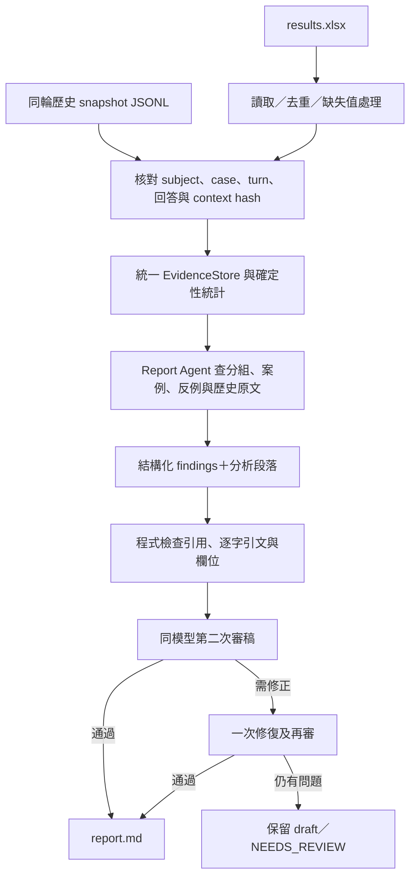
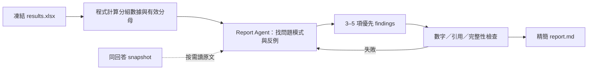

# Report 流程盤點與精簡建議

日期：2026-09-22。範圍僅涵蓋 report 路徑；這是讀碼研究與重構提案，不是已完成重構的聲明。本次沒有外部模型呼叫，也沒有重跑評分。

## 結論

目前有 **兩條 LLM 報告路徑**，功能沒有收斂成一個入口。建議只保留一個 Report Agent 產品角色，以 `results.xlsx` 為分數與分析維度的權威入口，按需查閱同回答、同版本的 snapshot。程式負責統計與引用驗證，Report Agent 負責找模式、選例、提出待驗證修改；不重新評分。

現有 snapshot-aware 路徑強制至少 6 個章節、8 個 findings（至少 2 個優點、4 個問題），並要求 4000–7000 中文字。這會讓少量發現也必須寫成長報告；精簡時應首先移除這些配額，改為「有證據且能改變下一步決策才寫」。

## 現況：哪條路徑負責甚麼

| 路徑 | 輸入與工作方式 | LLM 角色 | 目前接線 |
| --- | --- | --- | --- |
| `evaluation/xiaoan_eval/report_agent.py` 與 multimodels 同名檔 | 只讀 workbook；逐次 read/search，再 finish 提交 findings＋Markdown | 一個分析／寫作角色；沒有第二次語意 reviewer | 普通 deliverables、matrix 及 report-workbook 使用 |
| `evaluation_report_agent/` | Workbook adapter＋歷史 snapshot；查案例、分組與原文；findings→檢查→report | 分析 writer；同一配置模型的 reviewer；需要時修復及再審 | 獨立 `python -m evaluation_report_agent` 入口，未取代上方通路 |

兩個內嵌 `report_agent.py` 經本次 `cmp` 確認相同。不能將「一個模型」理解成「只呼叫一次」，也不能將同模型第二次審稿描述為獨立模型或人工驗證。

程式證據（repository-relative `file:line`）：

- `evaluation/xiaoan_eval/report_agent.py:18`：workbook-only 指令及 read/search/finish 協定。
- `evaluation/xiaoan_eval/report_agent.py:172`：生成迴圈；`206` 驗證 finish；`223` 保存 findings；沒有 reviewer 呼叫。
- `evaluation/xiaoan_eval/deliverables.py:25`：先建立 workbook，再呼叫內嵌 generate_report，驗證 generation_id 後發布成對檔案。
- `evaluation_multimodels/xiaoan_eval/cli.py:271`：matrix 匯入內嵌 generate_report；`278` 先寫 xlsx、`279` 再生成 report。
- `evaluation/xiaoan_eval/report_agent.py:241`：report-workbook 可只重試報告，不重跑 subject 或 Judge。
- `evaluation_report_agent/__main__.py:9`：獨立入口，workbook 與 snapshots 為必要參數；`25` 才判斷是否執行 LLM。
- `evaluation_report_agent/agent.py:251`：分析；`282` 明確註明同模型 critique；`284` 審稿；`289` 修復；`297` 再審；`307` 寫 findings/report。

另有 `render_decision_report` 與 `render_matrix_report` 舊模板函式仍存在（`evaluation/xiaoan_eval/deliverables.py:68`、`evaluation_multimodels/xiaoan_eval/multimodel.py:1051`）。在本次檢查的普通發布／matrix CLI 路徑，它們不是預設報告引擎；不可因函式存在就多算一個活躍 Report Agent。

## 目前 snapshot-aware 流程

有價值且應保留的部分：

- **歷史綁定**：以 subject＋case＋turn 找回答，核對回答 hash、workbook context hash（若存在）、provider request hash、context unit hash。缺資料不偷換成目前 repo 版本。`evaluation_report_agent/evidence.py:259`。
- **只傳允許的證據**：從 snapshot 選取 model-visible context units／設定，不整包發送 private trace。`evaluation_report_agent/evidence.py:294`。
- **按需查證**：`get_case`、`compare_groups`、`read_evidence`、`search_evidence`；支持分頁。`evaluation_report_agent/evidence.py:340`。
- **分清結論層級**：數據事實、Judge 判定、分析假設；無對照實驗不斷言 router/capsule 是根因。`evaluation_report_agent/agent.py:18`。
- **可恢復及可追溯**：workbook／snapshot 身分、成功 request cache、原始輸出、工具閱讀紀錄、draft 與 validation。`evaluation_report_agent/README.md:49`。

限制：引用與引文存在性可由程式檢查，但任意自然語言百分比、因果推論沒有因此全部被機械驗證。程式自身也明確標示 same-model review 不是 proof（`evaluation_report_agent/agent.py:310`）。

## 建議：報告階段只露出一個角色

上圖是**建議架構，尚未接線實作**。3–5 是上限附近的預設呈現目標，不應強迫最少三個問題；如果只找到一個可靠問題，就只寫一個。

1. 單模型、多模型及 report-only 命令都呼叫同一個 report service。保留 adapter 相容舊 workbook，但不保留兩份不同分析引擎。
2. 將 snapshot reader、確定性統計、引用檢查保留為普通程式工具，**不另算 agent**。
3. Reviewer 是可選的品質控制步驟；若開啟，方法文件明列額外一次 LLM 呼叫及其同模型限制，不把它偽裝成額外證據。
4. 把程式算出的統計寫成可引用 fact object。Report Agent 引用其 ID，不自行猜平均與分母；後續 validator 驗證結構化數值，而非只檢查 quote 存在。
5. 檢查「每項重要結論都有讀過的證據」；去掉 ≥6 sections、≥8 findings、必須4個問題、4000–7000字等配額。現有硬限制在 `evaluation_report_agent/agent.py:42`、`:85`、`:94`。
6. XLSX 是報告的分數入口，snapshot 是解釋產品元件的佐證。Raw Judge／request／完整歷史快照留私有 audit 檔，主報告不複製，也不為了讓 xlsx 看起來簡單而刪除可追溯資料。

## 最終 report 只需回答四件事

| 內容 | 最少資訊 |
| --- | --- |
| 這輪可相信多少 | 測試版本、模型、案例／回答數，各主要分數的有效 n 與缺失 n；只有影響解讀的缺失才展開 |
| 哪些地方弱 | 主要品質、faithfulness、relevancy 結果；按 task／risk／限制／多輪階段／route 找出的少數弱項，附分母 |
| 為甚麼值得改 | 每個 finding 1–2 個短引文、案例／輪次定位、反例或未覆蓋範圍；明列觀察与假設 |
| 下一輪改甚麼 | component、具體修改、預期改善、指定回歸案例、成功標準、不得退步的行為 |

建議主報告約 2–4 頁；篇幅隨可靠發現數調整。全欄位字典、完整逐案分數、hash、provider request、完整 claims 列表不放正文。安全重大問題即使只出現一次也獨立突出；「低分集中於某 route」僅是定位線索，沒有路由真值與受控對照不能稱 route 是根因。多標籤情境可能重疊，不能把各組 n 相加當總樣本。

## 驗證狀態與重構驗收

本次只檢查源碼和既有產物，未重跑測試。`evaluation/runs/2026-09-22-minimal32-agent-pilot/pilot-status.json` 記錄 8 個離線測試通過、89 份回答匹配歷史快照，以及當時 live report 未生成；該檔的授權拒絕原因是歷史狀態，不能直接當成現行授權判定。本文不據此宣稱目前所有 report 命令均已 live 驗證。

重構後應以少量固定 fixture 驗收：

- 同一 xlsx 重跑 report，統計完全一致，且不重新呼叫 chatflow／Judge。
- 同回答多 Judge 不會膨脹回答數；跨 Judge 結果不無提示混平均。
- 缺失值不等於零；不同分母不能混用。
- 快照錯配必須失敗；缺失快照只允許方向性建議，不聲稱已定位歷史 prompt 原文。
- 少於三項可靠 findings 時可正常完成；沒有可靠產品問題也不強迫編出問題。
- 每個優先修改能回到證據與指定回歸案例；沒有實驗就不宣稱預期改善已發生。

## 研究來源

主證據是上述當前程式碼。另已透過 `read_thread` 讀取使用者指定的「Locate evaluation report 流程」（`01a0c573-d6ad-7fd1-94ed-91e21ac6e7a0`），只用來理解 workbook＋本輪快照的設計動機；並未以聊天中的成功聲明取代本次代碼／產物核對。
