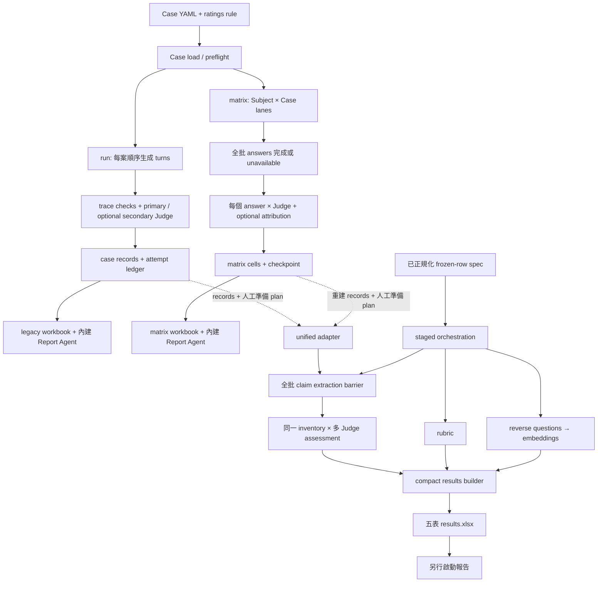

# Evaluation 工作流、欄位與交接盤點

盤點日期：2026-09-23。範圍：`evaluation/`、`evaluation_multimodels/`，以及兩者下游 Report Agent。依據為本機當時工作樹的程式、資料載入結果及離線合成測試；本輪只新增盤點文件。

目前有三條活躍執行路徑，而非一條完全統一的 pipeline：

| 路徑 | 評測對象與入口 | 主要輸出 | 下一個 consumer |
| --- | --- | --- | --- |
| 部署回歸 | 兩個 package 都有 `xiaoan-eval run`；呼叫 HTTP Chatflow | case records、private checkpoint／attempt ledger；`results.xlsx` + `report.md` | 舊 workbook、人工 review、baseline／experiment；records 可另接 unified |
| Subject × Judge matrix | `evaluation_multimodels` 的 `xiaoan-eval matrix` | answer／judgement／cell checkpoint；matrix `results.xlsx` + `report.md` + `pairs/` | matrix 分析、報告；重建 records 後可接 unified |
| 凍結答案語義測量 | 兩個 package 都有 `measure unified`／`measure staged` | `results.json` + `results.xlsx` + `results.md` | compact workbook consumer／Report Agent；目前仍有資料投影缺口 |

`unified` 做 claim extraction + claim assessment + requirements；`staged` 在此基礎上平行安排 rubric、faithfulness、relevancy 三個分支。兩者都不生成原始 Chatflow 答案。`results.md` 目前只是簡短產物說明，不是 LLM 分析報告。

## 1. 已接線的流程圖

實線是既有程式呼叫；虛線是需要另備 plan／轉換資料的交接。普通 `run` 先完成一個 case 的回答，再評該 case；不同 case 可並行，沒有 matrix 的「全批答案先完成」barrier。`matrix` 有全批 subject barrier。Shared core 另有「全批 extraction 完成後才 assessment」barrier。

## 2. 上游：案例、版本與被測執行

### 2.1 Case 載入／preflight

程式：`xiaoan_eval/cases.py:load_cases/load_case`、`reference_oracle.py`；兩套 loader 相同。

| 輸入層 | 欄位 | 要求與用途 |
| --- | --- | --- |
| Case 必需 | `schema_version="2.0"`, `id`, `test_objective`, `quality_focus`, `turns`, `oracle_provenance` | `id` 匹配 `TC-*.yaml` 檔名；focus 必須是評分規則模組名稱 |
| Turn 必需 | `turns[].turn`, `turns[].user` | turn 從 1 連續編號；保留順序 |
| Turn oracle，按評測需求提供 | `expected.safety_levels`, `route_ids`, `preferred_route_id`, `must_include`, `forbidden_behaviors`, `source_refs`, `wiki_refs`, `capsule_ids` | 決定 safety／route／retrieval 等期望；preferred route 必須在 accepted routes 集合內 |
| 回答要求 | `expected.response_oracle.{required_claims,forbidden_claims,must_cite,should_abstain,max_chars,expected_tools,goal_completed,max_steps,reference_answer}` | 欄位可選；給 response-oracle／工具／任務診斷使用，並非已轉成 unified requirements |
| Reference 標籤 | `expected.reference_oracle.{version,status,snapshot_id,scope,route_contracts,ground,reviewed_by,reviewed_at}` | `version=case-reference-oracle/v1`；`ground` 含 activation、required/background node IDs、background source refs；審批範圍與 response oracle 分開 |
| 審閱與聚合 | `oracle_provenance.{source,status,reviewed_by,reviewed_at,legal_effective_date}`；`maturity`, `scenario_id`, `coverage_axes`, `comparability_group` | reviewed／approved 需 reviewer／日期；`APPROVED_AGGREGATE` 是另一項明確決定 |
| 記憶檢查，可選 | `memory_checkpoints[].{after_turn,facts,usage,check_type}` | 綁定指定 turn 的 state／memory observation |

**輸出：** 每個檔案一個 `CaseLoadResult{case_id,source,case,preflight}`；preflight 含 `status=ready/needs_remediation/invalid`、issues、remediations。獨立 `preflight --output` 寫 `1.1-preflight.json`、`1.2-case-remediation.md`。

**交接：** typed `TestCase` 直接交 runner。`run` 遇 schema-invalid case 停止；`matrix` 目前只取 `case is not None`，會略過無法解析的 case。`needs_remediation` 不是兩條入口的統一硬阻擋條件。

當前兩邊頂層 `TC-*.yaml` 均為 **75 案／221 輪**；本輪未配置 PII validator 的 loader 結果均為 **51 ready、24 needs_remediation、0 invalid**；maturity 為 **74 REVIEWED、1 PROVISIONAL_DESCRIPTIVE、0 APPROVED_AGGREGATE**。loader 只 glob 頂層 YAML，不會自動納入 `proposed/`。這是整個目錄盤點，並非任何既有 Minimal33 run 的完成數。

### 2.2 凍結 run／模型設定

| 路徑 | 必需輸入 | 輸出／handoff |
| --- | --- | --- |
| `run` | `RunManifest`: `run_started_at`, `product_version`, `safety_policy_version`, `output_guard_version`, `prompt_hashes`, `knowledge_versions`, `model_ids`, `provider_versions`, `hyperparameters`, `run_config`, `evaluator_version`, `rating_rule_hash`, `rating_rule_schema_version`, `judge_prompt_version`, `seed`, `retry_policy` | manifest fingerprint；CLI 另建 `SuiteManifest`，包含 suite／taxonomy／scoring version、case digest、expected turns、分組與 maturity、retry policy |
| `matrix` | subjects／judges 為 `ModelSpec{provider,model,tier,reasoning_effort?}`；cases、rating rule、transports、併發、self-judging 選項 | `ModelSpec.id=provider:model:tier:reasoning_effort-or-na`；checkpoint contract hash 綁定執行契約 |
| 共用模型配置 | 內建 provider 讀取 `evaluation_multimodels/.env` 的角色模型欄位；API keys 留在 provider 配置 | 傳遞模型身分和版本；本輪未讀取／輸出金鑰，未呼叫 live provider |

`run` CLI 所需操作參數包括 `cases`, `--base-url`, `--manifest`, `--judge-plugin`, `--context-provider`, `--output`，另有 rating rule／evaluator config、optional secondary／attribution provider。`model_ids` 在執行時由共用配置填入，manifest 不是模型設定的唯一來源。

### 2.3 Subject 生成答案

| 路徑 | 輸入 | 輸出 | 交接與恢復 |
| --- | --- | --- | --- |
| `run` | case turns 的 user text；HTTP transport；conversation ID；模型 override | `CaseRunResult{case_id,status,conversation_id,turns}`；每輪 `TurnRunResult{turn,response,trace,error}` | 一個 case 建立獨立 conversation，輪次順序呼叫；交 `EvaluationPipeline.evaluate_case` |
| `matrix` Chatflow | 同一 case 的當前 turn user；subject ModelSpec；具 `start_case/end_case` 的 transport | `ProviderResponse` + `answer_id`；完整 answer event | 同 lane 依序生成，跨 lane 受 concurrency 限制；全批完成或 unavailable 後才啟動 Judge |
| `matrix` direct | subject ModelSpec + 當前 turn prompt | 同一 `ProviderResponse` envelope，通常沒有 Chatflow trace | 是否有 session 取決於 transport；runner 沒有把先前 turns 的 history 傳給 subject `invoke`，不能據此視為等同 stateful Chatflow |

`ProviderResponse` 核心欄位：`provider`, `model`, `status`, `text`；附帶 `trace`, `request_id`, `error`, `error_type`, `attempt_count`, `retry_errors`, `first_character_ms`, `elapsed_ms`, `queue_ms`, `input_tokens`, `output_tokens`, `total_tokens`, cache token／ratio 欄位。缺 telemetry 保留 null。

`run` 私有檔案：output 相鄰 `.<output-name>.private/evaluation-checkpoint.jsonl` 和 `suite-attempts.jsonl`。後者每筆含 `suite_fingerprint,case_id,attempt,execution_complete,outcome,record_digest,record`；重跑選第一個成功且完整的 attempt。要給下游 records consumer，需抽出選定 attempt 的 `record`，不能把 ledger envelope 直接當 case record。

`matrix` 預設私有檔案：output 相鄰 `.matrix-audit/<output-name>/matrix-checkpoint.jsonl`。有 `answer`, `judgement`, `cell`, optional `attribution` 等 event。`--resume` 重用相容完成結果；`--retry-unavailable` 可重試失敗 cell，失敗／不完整 stateful subject lane 則可能整 lane 重跑並使舊 Judge cell 失效。

## 3. 舊 run／matrix 的 Judge 與聚合

### 3.1 `run` trace checks → Judge → case record

| 步驟 | 欄位輸入 | 輸出 | 交接 |
| --- | --- | --- | --- |
| deterministic checks | `expected`、oracle approval、`trace.{safety,route,ground,guard,state,timings,tokens}`；PII validator 結果；known route IDs | 每項 `MetricResult{status,value,reason,evidence_refs}`；observations、turn traces、`response_sha256` | execution error／PII 拒絕會短路當輪 Judge；其餘 metrics 保留供聚合 |
| authoritative context | `case`, `expected_turn`, `actual_turn.trace` | context-provider 產生 authoritative context；與 trace context 組 evidence catalog | context resolution error 留 ERROR，不補造證據 |
| primary Judge | `schema_version,case_id,turn,assistant_answer,redacted_user_input,redacted_conversation_history,trace,capsule_content_units,quality_focus,expected,rating_rule,authoritative_context,evidence_catalog` | `red_lines[{id,triggered,evidence,uncertainty}]`、`dimensions[{module,score,supporting_evidence,deduction_evidence,uncertainty}]`、`legal_claims`, `faithfulness_claims`, `oracle_assessment` | JudgeClient 驗 JSON／模組／red-line IDs／evidence refs，通過才計分 |
| optional secondary | 同一 Judge request + review config、critical flag、quality threshold／release review | primary／secondary 審閱結果、reconciliation reasons、review status | secondary 是規則觸發；缺 secondary 時可保留 primary score，不是全批必做步驟 |
| optional attribution | answer + 同輪 `effective_context_snapshot` + judge version | claims、policies、abstention、evidence catalog／parameter contracts | 加入 observations，用作來源參與診斷 |
| case 聚合 | 全部輪次 metrics／TurnQuality、expected turns、oracle／threshold、review status | case record：`case_id,status,conversation,safety,pipeline,quality,performance,review,failure,cohorts` | `build_report_model` → workbook；review queue、baseline／experiment 從此分支出去 |

Trace 時間欄位契約含 `ttft_ms,first_guarded_delta_ms,router_ms,ground_ms,generation_ms,total_ms`；token 欄位至少 `input,output`。這條 pipeline 沒有自動呼叫 shared-core extraction／assessment；舊 Judge 的 `faithfulness_claims` 不會自動變成 unified inventory。

### 3.2 `matrix` answers → Judge cells

Judge request 有 stable 區（schema version、score scale、red lines、modules、oracle response schema）及 dynamic 區：`case_id,turn,user,answer,history,quality_focus,judge_evidence,expected,oracle_contract`。這裏的 history 是成功 subject turns 的 `{user,assistant}` 列表，格式與 unified 的 `{role,content}` 不同。

每個 cell 輸出：`answer_id,case_id,turn,subject,judge,answer,judgement,scores,oracle_assessment,expected_red_line_ids,triggered_red_lines,red_line_evidence,self_judging,primary_eligible,coverage,memory_metrics,attribution,weighted_score,expected_turns,scoring_contract_version,status`。

主鍵為 `(answer_id, judge.id)`；answer 本身按 `answer_id` 去重。自評預設隔離；pair summary 按完整 case 聚合再 case-macro mean。缺輪／provider 失敗保留 unavailable。這條 matrix 目前也不會自動執行 unified claim extraction 或 staged 三分支。

## 4. 舊產物 → frozen-row spec 的轉換

入口：`xiaoan_eval/unified.py:load_records → attach_records → prepare → runtime.evaluate`。

| 上游 | 可讀欄位 | 轉換動作 |
| --- | --- | --- |
| plain case-record JSONL／JSON array | `case_id`, `subject_id`；`conversation.turns[].{turn,user_input,assistant_response}`；`pipeline.turn_traces[].{turn,trace.effective_context_snapshot}` | 用 `(subject_id,case_id,turn)` 對齊 plan；單 subject plan 可補 subject ID；核對 question |
| matrix cell records | `subject.id`, `case_id`, `turn`, `answer.{status,text,trace.effective_context_snapshot}` | 只附加 PASS 且有文字的 answer；同 answer 的多 Judge rows 去重；答案／snapshot 衝突拒絕 |
| `records_file` | 相對於輸入 spec 檔案的 JSON／JSONL 路徑 | 載入後記 `source_artifact_hash`；不會直接解析原始 matrix event log 或 XLSX |

**仍需準備的 plan：** planned subjects／turns、每輪 question、正確 conversation prefix、subject identity、approved requirements／truth、extractor／judges。現有 adapter 只接答案和 snapshot，沒有自動把 Case YAML 的 expected／response oracle 轉成這些欄位。

Snapshot 正規化契約為 `effective-context-snapshot/v1`，含 `snapshot_id,turn,context_kind,router,composer`；invocation 含 `status,units,reason?`；unit 含 `occurrence_id,unit_id,layer,source_turn,content,content_sha256,policy_ids`。亦可由 runtime `invocations` envelope 正規化。

`prepare` 驗 snapshot turn 與 composer `INVOKED`，產出 `context[{ref,content,layer}]`、`context_version=snapshot_id`、`context_capture=EXPOSED`，移除任意 trace。資料缺失時不讀目前知識檔補回歷史 context。

**重要入口差異：** `measure staged` CLI 直接把 spec 給 `run_orchestration`，沒有呼叫上述 `load_records/prepare`；當前必須先準備好 normalized context rows。僅放 `records_file` 或 `effective_context_snapshot` 並不足以完成這條交接。

## 5. Unified／staged 共用的欄位契約

### 5.1 整批 spec 和每輪 frozen row

| 範圍 | 欄位 | 必需／條件 |
| --- | --- | --- |
| CLI envelope | `schema_version="evaluation-methods/v3"` | measure CLI 必需 |
| core contract | `contract="xiaoan-unified/v1"` | unified／staged faithfulness 必需 |
| 執行計劃 | `planned_subjects`, `planned_turns`, `rows` | 每個 subject × case × planned turn 都有 row，包括 unavailable |
| evaluator identity | `extractor`, `judges[]` 各含 `id,provider,model,family,prompt_version` | 全部為非空字串；judges 非空、ID 唯一 |
| row identity | `answer_id,case_id,turn,subject_id,subject_provider,subject_model` | answer ID 唯一；subject/case/turn 唯一；turn 正整數；`subject_family` 可选 |
| 原文 | `status`, `question`, `answer`, `history[{role,content}]` | `AVAILABLE` 才進 extraction；history 僅已完成 user／assistant messages，缺省 `[]` |
| faithfulness evidence | `context_capture="EXPOSED"`, `context_version`, `context[{ref,content,layer}]` | assessment 必需明確捕獲狀態／版本；context 可為空但不能假裝已捕獲未知資料 |
| independent correctness evidence | `reference_facts[{ref,content,layer}]`, `truth_status`, `truth_version` | reference facts 非空時 `truth_status=approved`、version 必需，layer 僅 SOURCE／REFERENCE；無真值時 factual correctness 為 UNKNOWN |
| requirements | `requirements[{id,kind,text,critical}]`, `oracle_status` | kind 為 safety/task/constraint/interaction/route/evidence；critical 為 boolean；正式 gate 需 `oracle_status=approved` |
| trace 衍生觀察 | `observations: {requirement_id:{status,value}}` | route／evidence requirement 做確定判斷需 AVAILABLE observation；value 是 bool／string／null |
| 跨輪限制，可選 | `conversation_constraints[{case_id,id,text,critical,start_turn,end_turn?,status}]` | core 按區間展開為 constraint requirement；未 approved 會使 row oracle provisional |
| 離線重用，可選 | `inventory`, `assessments:{judge_id:payload}` | 必須通過與 live response 相同的 binding／schema 驗證 |
| 抽取審核，可選 | `audit_sample_fraction`, `audit_seed`, `audit_extractor`；row 的 `human_inventory`, `inventory_audit` | 分開檢查抽取覆蓋；不以評委一致性替代人工 gold |
| 展示／rubric | `quality_focus`, `route`, `capsule`, `scenario`, `snapshot_ref` | 部分欄位有 alias；不由 results builder 自動推論 |

### 5.2 各 evaluator 的 handoff

| 步驟 | 接收輸入 | 產生輸出 | 下一步如何接收 |
| --- | --- | --- | --- |
| Claim extraction | `answer,question,history` + extractor identity；request 帶 `contract,task,identity,binding,instructions` | `{binding,claims[{id,kind,proposition,conditions,answer_span:{start,end,text}}]}`；validator 加 `extractor,contract,inventory_id` | 全批 extraction 終態後，以 answer ID 找 frozen inventory；多 Judge 共用同一份 |
| Claim／requirement assessment | inventory + answer/question/history + context/version + independent truth/version + requirements/oracle status/observations + Judge identity | `{binding,claims[{id,faithfulness,correctness}],requirements[{id,verdict,reason,answer_spans}]}`；每個 claim dimension 為 `{verdict,evidence:[{ref,start,end,text}],reason}` | claim IDs 和 requirement IDs 必須完整匹配；exact Unicode span／domain refs 通過才計 metrics |
| claim metrics | inventory + validated assessment | faithfulness／correctness counts、eligible/known/unknown、strict rate、known support／coverage、contradiction、by-kind、layer participation | 存在 `cells[].metrics`，交摘要／results 投影 |
| requirements gates | 展開後 row requirements + assessment + oracle status | items、by-kind、`safety_gate,task_gate,release_gate` | 存在 `cells[].requirements`；core summary 按 subject/Judge/case 彙總 |
| Rubric（staged） | `answer_id,question,answer,history,quality_focus,rating_rule` | provider 回 `dimensions[]` 和 `red_lines[]`；validator 輸出 `scores,weighted_total,final_weights,triggered_red_lines,status` | 依 answer ID 交 results builder；與 claim 分支獨立 |
| Reverse questions（staged） | provider 只收 `generation_input={answer,n,instructions}`，預設 n=3 | 所需 response 為 `{binding,questions:[...]}` | 先驗 frozen task binding，才可 embedding |
| Embeddings／relevancy | 原 question + reverse questions；`model_id,revision,vectors:{text:vector}` | `score`（平均 cosine）、similarities、n、duplicate_questions、binding、embedding identity、status/reason | 每 answer 一個 relevancy，寫入 Answers；不是每個 claim/Judge 一個 |

Claim kind：FACTUAL／INTERPRETIVE／RECOMMENDATION／ACTION／SUPPORTIVE。Verdict：ENTAILED／PARTIAL／CONTRADICTED／UNSUPPORTED／UNKNOWN／NOT_APPLICABLE。Requirement verdict：SATISFIED／VIOLATED／UNCERTAIN／NOT_APPLICABLE。

`strict_rate = ENTAILED / eligible`；eligible 排除 NOT_APPLICABLE、保留 UNKNOWN。`known_support_rate` 分母再排除 UNKNOWN。零分母為 null。Requirements safety gate 包括 safety 類與所有 critical requirements；task gate 包括 task／constraint。gate 只反映提供且批准的 requirements。

**checkpoint：** `--checkpoint-dir/<request-hash>.json` 保存成功且驗證通過的 extraction／assessment 原始 response；每次 reuse 重驗 hash 和 payload，失敗可重試。目前 rubric／relevancy 分支沒有接入這個 `ResponseStore`；Python API 可提供 supplied stage observations，CLI 尚未完整接線。

## 6. 聚合、輸出與報告的實際邊界

### 6.1 三種 workbook 和兩種 JSON

| 產物 | 實際內容與 join key | 下游限制 |
| --- | --- | --- |
| `run/results.xlsx` | `00_Overview`、`01_Cases`、`02_Turns`、`03_Metrics`、baseline／experiments／review／stability／metadata／dictionary，加可讀明細 sheets；case/turn、comparison key、generation ID、response hash | 普通人工 review／baseline consumer 使用這個 schema |
| `matrix/results.xlsx` | `Matrix`, `Oracle_Coverage`, `All_Answers`, `All_Judgements` 等；answer_id 與 subject/Judge identity；可帶 scenario／明細 | answer 去重；Judge 分開保存；`pairs/` 為 subject/Judge 配對 workbook |
| compact `results.xlsx` | 固定 `Overview`, `Answers`, `Scores`, `Claims`, `Rating_Details` | Report Agent 可讀，普通 `read_workbook`／human review 不接受此 schema |
| `measure unified/results.json` | 頂層 `schema_version=results/v1` + 五張表 | CLI 目前只保存 compact 投影，沒有完整 core envelope |
| `measure staged/results.json` | 頂層 `orchestration_contract,rubric,faithfulness,relevancy,results,stages` | 五張表位於 `.results`；完整 claim/gates 在 `.faithfulness` |

五表欄位：

- `Overview`：`metric_id,value,status,numerator,denominator,scope,note`。
- `Answers`：`answer_id,subject_id,case_id,turn,question,answer,status,route,capsule,scenario,answer_relevancy,relevancy_status,snapshot_ref,reason`。
- `Scores`：`answer_id,evaluator_role,judge_id,status,weighted_total,faithfulness,faithfulness_supported_n,faithfulness_applicable_n,faithfulness_unknown_n,required_coverage,redline_status,redline_ids,reason`。
- `Claims`：`answer_id,judge_id,claim_id,claim,kind,answer_quote,verdict,evidence_refs,evidence_quote,reason,status`。
- `Rating_Details`：`answer_id,judge_id,detail_type,detail_id,score,verdict,status,answer_quote,evidence_refs,reason`。

Core `evaluate()` 完整回傳有 `inventories,cells,audit_samples,requests,source_artifact_hash,stages,summary,calibration_status,results`。完整分析應保留這一層，五表尚不是無損交接。

### 6.2 Report 不是只有一個實作

| 報告路徑 | 輸入 | 輸出／handoff |
| --- | --- | --- |
| package 內 `xiaoan_eval/report_agent.py` | workbook、mandatory metric dictionary、report provider、max steps/context limits | LLM 讀／查 sheet，回 report/findings；核對 row refs／quotes；產生 `report.md` 和相鄰 `.report-agent-audit`。`run`／`matrix` 發布時自動呼叫；`report-workbook` 可單獨呼叫 |
| root `evaluation_report_agent/` | `--workbook`, `--snapshots`（plain case-record JSONL）, `--output`；模型／max rounds；`--execute` | 離線先準備 evidence/facts/manifest；execute 後產生 report/findings、requests/calls、review/validation。讀 compact、single、matrix workbook；snapshot 需另綁定同 answer/subject/context |

內建報告是評測後仍可能失敗的一個 provider 階段；`run/matrix` 預設等待報告成功才發布最終 workbook/report pair。因此「checkpoint 有答案／分數，但 output 沒有完整交付物」是可能的實際狀態。`measure unified/staged` 不自動呼叫這個 Report Agent。

### 6.3 人工 review 和回歸比較

普通 review 流程：`PENDING_REVIEW` workbook → `export-human-review` → review packet + `.xiaoan-review-trust` → `import-human-review` → 如有分歧再 `adjudicate`。

Packet 主键／不可改欄位：`review_id,case_id,turn,response_sha256`、user／assistant text、item definitions 和 evidence。人工可填 queue 的 `reviewer_id,submitted_at,confidence,notes`，以及 item 的 `score,triggered,evidence_refs,deduction_reason`。Import 核對 `base_generation_id,base_core_digest,base_lifecycle_digest,trust_digest`；保留 automatic／human／final provenance。這個 review workbook consumer 尚未適配 compact／matrix schema。

## 7. 其他可選工作流

它們由明確 CLI／函式啟動，不是每個 run 的固定下一環節。下面列出各自入口所需的關鍵資料；完整 item schema 以列出的函式為準。

| 入口 | 關鍵輸入欄位／產物 | 輸出與下一步 |
| --- | --- | --- |
| `report` | plain case-results JSONL；optional PII validator | `build_report_model` → 舊 workbook + 內建 LLM report |
| `experiment` | baseline／variants、對應 manifests、target cohort、lever type、target、config | 控制變量核對、delta／guardrails／實驗結論 → workbook/report |
| `auto-experiment`／`auto-file-experiment` | recommendation、target cohort、variant-runner plugin、config；前者另要 baseline/manifest | runner 產生受控 variant、驗證、ledger／報告；file variant 限 allowlist |
| `stability` | repeated runs + manifests | router／RAG／response 穩定性摘要 → workbook/report |
| `measure answer` | `answer,question,context,reference_facts,context_version,truth_version,judge_version,assessment`；可選 oracle request/assessment | 已提供語義標籤的測量摘要；這個舊 method 使用 mapping evidence、SUPPORTED 等標籤，與 unified contract 不同 |
| `measure retrieval` | rows 的 `query_id,k,ranked_ids,qrels,judgments_complete`；corpus/chunk/retriever/reranker/qrels versions | MRR/AP/nDCG@k、按配置分層；未判候選保留 unavailable |
| `measure oracle` | rows 的 `request,assessment` | 驗證 oracle assessment 後摘要 |
| `measure pairwise` | `answers,pairs,judges,controls`；answer 含 version/case/turn/question/history/rubric/context hash/control hash/answer hash/text/status | 左右交換 Judge 結果、勝出／平局／順序不一致、case-cluster 區間 |
| `measure cluster` | rows 的 `case_id,unit_id,status,value`；paired 時 baseline/variant；seed | case-macro estimate、CI、有效／缺失單位數 |
| `measure outcome` | row 的 spec（`task_id,observer_id,subject_id,snapshot_id,checks`）+ independent observation（facts/calls） | 外部觀察的 PASS/FAIL/UNAVAILABLE，供任務完成度診斷 |
| `measure perturbation` | `probes[{id,kind,controls,baseline,variant,assertions}]` + harness provider | baseline/variant receipts 和 assertions pass/fail/unavailable |
| `measure calibration` | frozen benchmark + hash、Judge/model/prompt/rubric versions、人工 gold／predictions | Judge 校準／標籤一致性；不是直接評 subject 的新總分 |
| `measure online` | session ID、arm、experiment ID、assignment version、mode、observation_complete、task/handoff/exit/failure outcomes、latency/cost | 按實驗配置與 arm 分層的 session outcomes／延遲／成本 |
| `measure capsule-ablation` | unified rows + controls（model/provider/prompt/knowledge/route/system prompt/mode/max tokens/seed/temperature）；subject provider | 固定 Composer context 的 WITH/WITHOUT_CAPSULE 答案、control receipts、paired evaluation；不涵蓋 route 改動因果 |
| scenario／knowledge diagnostics | records + `scenario-annotations/v1`、`answer-analysis/v1`，可加 knowledge review；以 question prefix／answer／context hash 綁定 | route/scenario/claims/AR/knowledge gap 明細 → report model／matrix sheets |
| cost analysis | answer/Judge usage + 帶 provider/model/rate 的價格目錄 | 已觀察費用／缺失 telemetry；可併入分析 |

非 unified/staged 的 `measure` methods 仍輸出 `measurement.json`、`measurement.md`；capsule-ablation 另有 `measurement.xlsx`。這些不是待刪的同名重複輸出。

## 8. Housekeeping 優先順序：已確認的交接缺口

| 優先 | 目前狀態／影響 | 建議整理動作與完成條件 |
| --- | --- | --- |
| P1 | `run/matrix` 未自動接 unified；case YAML → requirements／history plan 仍靠另備資料 | 建立明確 case/record/event → frozen-row adapter，保留 planned unavailable rows，產出可驗證 handoff manifest |
| P1 | `staged` CLI 未執行 `load_records/prepare`；同一輸入給 unified 能轉 snapshot，給 staged 未必可評 | 共用 ingress；用同一份 records/snapshot fixture 驗兩條 CLI |
| P1 | `unified/results.json` 是五表，`staged/results.json` 是完整 orchestration envelope | 決定版本化 envelope；五表作 projection，完整 stages／inventory／gates／request IDs 作 source of truth |
| P1 | runtime cells 只有 `inventory_id`，results builder 卻向 `cell.inventory.claims` 查原文，沒有 join 全域 inventories；合成測試中 `claim/kind/answer_quote` 均變 null | 以 inventory ID／answer ID join；golden path 驗每個 claim 可回到原文和 span |
| P1 | 五表未輸出 correctness、requirements items/gates、inventory audit、完整 evidence；core 有資料但 consumer 失去它們 | 明確保留完整 sidecar 或擴充 schema；報告端核對每個 gate 和 metric 能追溯 |
| P1 | compact Overview 是 available evaluator rows 的 mean，未用 `primary_eligible` 隔離自評，也沒有 core 的 case-level gate 語義 | 定義顯示用途；主指標沿用相同 eligibility／case aggregation。合成 probe 已確認 core primary cells=1，而 compact faithfulness denominator=2 |
| P2 | `run` schema-invalid 停止，`matrix` 過濾 invalid；needs_remediation／maturity 未形成一致入口 gate | 統一 included/excluded/planned 清單與原因；先分清描述性 run 和正式 aggregate run |
| P2 | rubric 結果把 dimensions 簡化成 score mapping，原 supporting/deduction evidence 不在回傳 dimensions；Rating_Details 因而可能缺理由 | 保留 validated dimension details，再做數值 projection |
| P2 | relevancy generator 只收到 answer/n/instructions，validator 卻要求完整 task binding；目前測試 provider 從 fixture 另行重建 binding | 由 orchestration 綁定回應或給受控 adapter task identity；用只見 provider 正式輸入的替身驗證 |
| P2 | `--checkpoint-dir` 只覆蓋 claim 分支；staged CLI 未接 supplied stage payloads；rubric identity 是 configured placeholder | 統一 stage identity、request hash、resume receipt；證明重跑只補失敗 stage |
| P2 | 內建報告與 root snapshot Report Agent 並存；普通 review consumer 只接受舊 workbook | 明確各 consumer 支援 schema 和必要 snapshot sidecar；將評測完成、報告完成、人工完成分開表示 |
| P3 | 兩套 `xiaoan_eval` 有大量鏡像檔；core 已共用，但 README 含舊 counts／理想化全流程 | 標明 canonical owner；先遷移 consumer，再退役入口／模組，保留歷史 runs 和 checkpoint |

另需留意：`measure unified` CLI 重新 build 五表時只傳 faithfulness cells，沒有轉交 spec 中可供 Python wrapper 使用的 rubric/relevancy stage；其 normalized snapshot version 也不一定投影回原 spec 的 Answers。這屬同一組 exporter／ingress 整理工作。

## 9. 驗證與來源索引

本輪離線驗證：

- `evaluation`：unified、orchestration、results adapter、rubric、relevancy 五個 focused suites，**49 passed**。
- `evaluation_multimodels`：unified suite，**30 passed**；該目錄沒有獨立 `test_orchestration.py`，三分支由共用 core 的單模型 suite 覆蓋。
- root `evaluation_report_agent/tests`：**9 passed**。
- 合成 probe：確認兩個 JSON 頂層差異、claim projection 的 null 欄位、自評分母差異；直接 loader 盤點兩邊全部頂層案例。
- 兩邊 `cases.py/pipeline.py/unified.py/report_agent.py` 當時逐 byte 相同；`measurement_cli.py` 差異為排版，所列入口差異兩邊皆有。

以上驗證說明目前程式行為；本輪沒有重跑歷史評測、付費 provider 或改動既有結果。

主要程式依據（均以 repository root 為基準）：

| 責任 | 檔案與函式 |
| --- | --- |
| CLI／交付 | `evaluation/xiaoan_eval/cli.py:_run/_evaluate_suite`；`evaluation_multimodels/xiaoan_eval/cli.py:_matrix`；兩邊 `measurement_cli.py:run` |
| Case／版本 | `evaluation/xiaoan_eval/cases.py`、`reference_oracle.py`、`manifest.py` |
| Subject／舊 Judge | `evaluation/xiaoan_eval/runner.py`、`pipeline.py`、`judge.py`；`evaluation_multimodels/xiaoan_eval/multimodel.py:run_matrix` |
| snapshot adapter | `evaluation/xiaoan_eval/unified.py:load_records/attach_records/prepare`、`evidence.py` |
| 共用 core | `evaluation/xiaoan_eval_core/contracts.py`、`runtime.py`、`scoring.py`、`orchestration.py`、`rubric.py`、`relevancy.py`、`results.py` |
| 共用方式 | `evaluation_multimodels/xiaoan_eval_core/__init__.py` 將 source checkout 指向 `evaluation/xiaoan_eval_core` |
| 報告／review | `evaluation/xiaoan_eval/workbook.py`、`deliverables.py`、`report_agent.py`、`review_workbook.py`；`evaluation_report_agent/evidence.py`、`agent.py` |
| 可選方法 | `evaluation/xiaoan_eval/measurement.py`、`comparative.py`、`scenario_analysis.py`；`evaluation/xiaoan_eval_core/ablation.py` |

