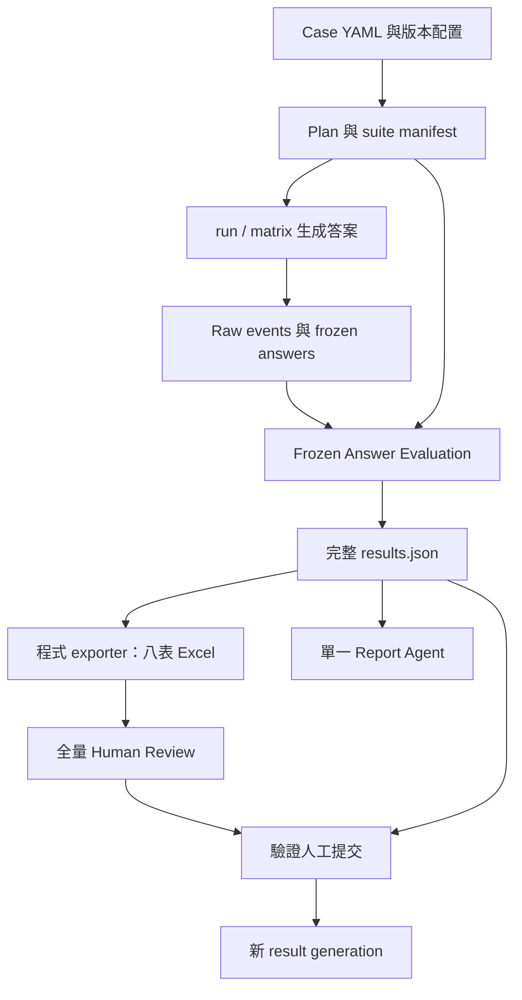

# Evaluation 工作流最終重構規格

日期：2026-09-24。本文將已確認決策收斂為實作契約；runtime 尚未按此規格修改。[對話精簡稿](2026-09-23-evaluation-workflow-simplified.zh-HK.md)保留決策脈絡，[原始盤點](2026-09-23-evaluation-workflow-handoff-inventory.zh-HK.md)保留當時程式調查。本文件是後續實作的規格入口。

目標為五個生命週期階段、單一評估引擎、完整 JSON、八表 Excel、單一報告與全量人工審閱。新入口與 active consumers 一次切換，不設過渡 alias、舊格式輸出、歷史資料匯入或相容 adapter。新流程本身保留版本、checkpoint 和恢復能力。

## 1. 架構與邊界



| 階段 | 責任 | Owner |
| --- | --- | --- |
| 案例與版本 | 凍結案例、oracle、模型、評估計劃與 preflight | Case adapter、manifest builder |
| 答案生成與凍結 | 按輪生成，保存回答、實際輸入、trace 和原始事件 | Subject runner、共用 freeze adapter |
| 評估執行 | 執行計劃中的 evaluator，保存各自判定與證據 | Shared core、orchestrator |
| 結果投影 | 完整 JSON、Excel、報告各自交付 | Serializer、Excel exporter、Report Agent |
| 人工審查 | 每次讀全部回答及各 Judge 評分，批准或修訂 | Review importer／exporter、使用者 |

唯一正式評估入口為 `measure frozen-answer-evaluation`，移除 `measure unified`／`measure staged`，CLI 與 Python API 共用 ingress。`run` 是部署回歸生成入口，`matrix` 是多 subject 生成入口；生成端需要端到端執行時只接同一評估引擎，不保留自己的 Judge pipeline。

多 Judge 使用同一份凍結答案，補評不重跑 subject。同一 stateful case 生成保持輪次順序；實際送入模型的 history 必須可追溯，不以事後重組歷史冒充實際輸入。完整 raw trace／provider events 保留作 provenance，下游只讀 canonical record。

## 2. Minimal33 最終來源與政策

### 2.1 已核對來源

本輪已定位最終產物，按 aggregate 批准及 partial-abstention 補充批准串接來源，核對兩套案例共 66 個 YAML 的現行 hash。新計劃使用以下 2026-09-24 來源。

| 來源 | 用途 |
| --- | --- |
| [selection.json](../../evaluation_multimodels/oracles/minimal33-update-2026-09-24/selection.json) | 33 案／100 輪、順序、來源與逐案 hash |
| [aggregate-approval-receipt.json](../../evaluation_multimodels/oracles/minimal33-update-2026-09-24/aggregate-approval-receipt.json) | 使用者批准範圍、66 個來源檔 hash、聚合政策 |
| [partial-abstention-receipt.json](../../evaluation_multimodels/oracles/minimal33-update-2026-09-24/partial-abstention-receipt.json) | 綁定 parent 批准；8 案／11 輪局部克制與繼續幫助邊界，關聯既有要求，不新增評分項 |
| [grouping-approved.json](../../evaluation_multimodels/oracles/minimal33-update-2026-09-24/grouping-approved.json) | 已批准六組分類 |
| [preflight.json](../../evaluation_multimodels/oracles/minimal33-update-2026-09-24/preflight.json) | 兩套各 33 ready／33 APPROVED_AGGREGATE；未配置 PII validator 的紀錄 |
| [verification.json](../../evaluation_multimodels/oracles/minimal33-update-2026-09-24/verification.json) | 前項工作的驗證證據，本次未重跑其中測試 |

固定接入 `comparability_group=minimal33_2026_09_content_v2`、`maturity=APPROVED_AGGREGATE`、`snapshot_id=sha256:181157ff8844b1411a9cab92687736031a5db35dd76a3f889098b0bf4f4ed340`。

| 檔案 | 本輪核對的 SHA-256 |
| --- | --- |
| selection.json | `31526a1182ca77265f8e5f4305bf9e429b4c216ee7745ac43296a1ef77b20808` |
| aggregate-approval-receipt.json | `012bb9f1666394ae6b9cba45d5a38a86a6df5315d92f2da621b2f038132a743d` |
| grouping-approved.json | `85785468b283ad60ad51a5cae669518b13e994a8a9d86830fcf63fabbc61f05b` |
| partial-abstention-receipt.json | `e3bd58a57e3e5e4793dd8d45a4d37169d8cad967cd3add608eacc8c375f85628` |

現行 case hashes 以 aggregate receipt 為底，驗證補充 receipt 的 parent hash 及各 before_sha256 後套用 after_sha256，與 selection 及 current_files 核對。補充批准保留 comparability_group 與 APPROVED_AGGREGATE；不能只用原 receipt 的 hash 拒絕已批准更新。

### 2.2 聚合資格與比較

正式品質聚合採 case 等權，UNAVAILABLE 排除並報覆蓋、不填零；完成 33 案才標為完整 Minimal33。六組作診斷，組別重組總分按有效案例數加權，不把六組等權平均。

| scenario_id | 案例數 | 輪次 |
| --- | ---: | ---: |
| crisis_response | 2 | 6 |
| coercion_and_safety | 5 | 17 |
| support_and_agency | 6 | 20 |
| access_and_equity | 6 | 16 |
| reporting_and_help | 5 | 16 |
| legal_remedies | 9 | 25 |

各 LLM × Judge 先展示自己的有效案例摘要；跨 LLM 比較則依已批准的 `common_complete_cases` 政策，在同一 Judge、同一指標下使用共同完整案例，另存比較集合與分母。兩者明確標名，不靜默替換。Gate 待確認分母另依第 6 節，不套 rubric 完整案例過濾。

實作時重驗來源 hashes，變更需新 manifest 及適用批准範圍。本次不重新制定 remediation 政策。聚合批准不自動擴張獨立 reference facts 的核准 scope。

## 3. Canonical 資料契約

### 3.1 Plan、身分與版本

Plan 表示要執行什麼，manifest 凍結條件與版本。保存有序案例、預期輪次、subjects、全部 planned units、preflight、maturity、分組、聚合政策、各模型角色與 prompt／schema／知識／runtime／oracle 版本、生成參數、seed、並行／限流／重試／快取策略、建立者及時間。未取得回答的單位不能消失；未知 revision 為 null，不補造。

| 主鍵／綁定 | 定義 |
| --- | --- |
| planned_unit_id | 生成計劃中的 subject × case × turn |
| answer_id | 該單位的一次凍結生成版本；重生成用新 ID，補評沿用 |
| answer_sha256 | 回答原文 UTF-8 hash；無回答為 null；review response_sha256 同義 |
| row_digest | 綁定問題、history、回答、身分、狀態與證據引用 |
| inventory_id | 綁定答案、extractor、抽取輸入與版本的唯一清單 |
| stage_id／request_digest／attempt_id | 邏輯工作／完整請求／每次實際呼叫，分開保存 |
| evidence_ref | 明確 domain 的 context／truth／answer／observation 來源與位置 |
| result_generation／core_digest | 完整結果版本與內容綁定，供投影、review 引用 |

Hash 使用固定序列化，manifest digest 不包含自己。Request digest 綁定實際輸入、模型／參數、prompt／schema／validator 版本；輸出目錄、排隊時間或報告版本不單獨使請求快取失效。模型身分來自共用配置，產物不含憑證。

### 3.2 Frozen answer

共用 adapter 從新版 run／matrix producer 直接建立 record，不接入舊 workbook／case-record 格式。每筆保存問題、完整回答、正確 history、subject、來源 digest、狀態與原因、context capture／version／內容、route／tool／state observations、生成 request、時間、延遲、token、cache usage、attempt 及 raw artifact refs。

答案、context、telemetry 的可用性獨立判定。缺 snapshot 不使完整回答消失；缺 telemetry 保存 null。部分回答為 PARTIAL，預設不作完整答案送評；未嘗試者不虛構 attempt。缺失 snapshot 不讀現在的 prompt／知識補回，raw／normalized 衝突須拒絕，不按最新內容覆蓋。

### 3.3 完整 results.json

| 區域 | 唯一責任 |
| --- | --- |
| schema_version、contract、run_ref | 契約與執行身分 |
| manifest、plan | 範圍、配置快照、oracle、版本及 planned units |
| answers | Frozen record 及缺失單位的關聯 |
| inventories | 完整 claims、kind、conditions、answer spans、extractor、audit |
| envelopes | 每 answer 的 inventory_id、rubric、assessments、checks、relevancy、human review、stage refs |
| stages | 工作及 attempt receipts、validated output refs、用量、錯誤、恢復 |
| aggregates | 指標、公式、scope、分子／分母、case 集合、排除原因與覆蓋 |
| artifacts | 原始 request／response／events 附件的相對路徑、類型、hash 與 owner |
| provenance | 來源、轉換、模型判定、人工修訂與採用決策關聯 |

所有評分、判定、理由、證據引文、snapshot 和 oracle 全文在 JSON；大量 raw events／請求可另存附件，兩者構成完整交付包。Inventory 只存一份，envelope 引用；requirements 判定保存於每個 Judge assessment，不建立另一份可獨立改寫的副本。

Claims 投影以 assessment.inventory_id 找 inventory，再以 claim_id 取 proposition／kind／answer_span，判定與 evidence／reason 來自 assessment。禁止從不存在的 cell.inventory 猜原文或只保留第一條證據。已標成功資料若 join、domain、hash、span 不一致，屬 integrity error，拒絕受影響投影；已知 provider 缺失則正常展示狀態。

## 4. Oracle 與評估分支

預設啟用 rubric、claims／requirements、relevancy、按適用條件執行的確定性檢查。分支由 plan 配置，模式名稱不決定隱藏行為。

### 4.1 Case YAML 映射

| 來源 | 評估輸入及規則 |
| --- | --- |
| turns.user、quality_focus | Question、rubric 焦點 |
| must_include、required_claims | Task requirements，回答要求不自動成為事實真值 |
| forbidden_behaviors、forbidden_claims | Safety／constraint requirements；critical 明示，不自動等於紅線 |
| safety_levels、route_ids、preferred_route_id、capsule_ids | Runtime expectations；accepted routes 與 preferred route 分開 |
| must_cite | 明確適用範圍的引用要求，不把內部 refs 一律當對外引用要求 |
| source_refs、wiki_refs、reference_oracle | 來源解析、scope／批准資訊；有獨立核准內容才生成 reference_facts |
| expected_tools、goal_completed、max_steps | 有有效執行觀察才判定，保留案例不適用聲明 |
| max_chars、reference_answer | 凍結字數算法；參考回答只作核准用途，不自動作 factual gold |
| memory_checkpoints、跨輪限制 | 按 after_turn／start_turn／end_turn 展開；保留範圍與所需觀察 |
| policy、should_abstain | 依 4.4 映射 requirements |

在評估前凍結 requirements 的 ID、來源、kind、critical、條件、輪次、批准資訊，Judge 不臨時新增。明確同規則 mapping 才去重，語句相似不自動合併。缺失及未映射欄位保存 remediation 原因。

Reference facts 保存 ref、content、SOURCE／REFERENCE layer、source digest、scope、truth_version 及批准依據。缺 truth 時版本為 null 並記原因，需真值的 claims 回 UNKNOWN，非事實性項目按契約回 NOT_APPLICABLE；案例整体批准不擴張 facts 的批准範圍。

### 4.2 Rubric

各 Judge 的每個維度分數及每項紅線均附非空理由、可取得的支持／扣分證據，包含滿分及未觸發者；遺漏可明確描述，不補造引文。失敗保存錯誤，不生成虛構評分理由。

紅線觸發仍完成所有適用維度評分及總分，不全部歸零；紅線使對應 gate FAIL，requirements 違反也不另扣 rubric。Prompt、rating rule、scoring、validator 和測試須同步更新到新契約。

### 4.3 Claims、requirements、relevancy、checks

Extractor 每答案抽取一次 claims，輸入 question／answer／history、不看參考證據，保存主張、條件、kind 和精確 answer span。多 Judge 共用 inventory，assessment 不重抽。

同次 assessment 回傳每個 claim 的 faithfulness（對 context）、correctness（對獨立 facts），各含 verdict、evidence refs／spans／引文、reason；並回 requirements 的 SATISFIED／VIOLATED／UNCERTAIN／NOT_APPLICABLE、理由與回答證據。Claims 和 requirements 分開驗證與保存。

Relevancy 反向生成問題，再 embedding 比較原問題；每答案一份，不按 Judge 複製。保存生成問題、各相似度、分數、模型版本及狀態，獨立展示，不入 rubric 總分或 gate。

確定性檢查由程式比對 expectation 與 trace，不額外呼叫 Judge。缺資料不可評，無適用條件不適用，不從回答風格推測 route／工具行為。

### 4.4 舊 attribution 功能去向

移除主 Judge 舊 faithfulness_claims 分支與獨立 attribution Judge，改由 assessment 和程式承接：

| 功能 | 新位置 |
| --- | --- |
| Claim support／unsupported | Faithfulness／correctness 計數，不恢復 PARTIAL 半分算法 |
| 證據來源層 | 對照 frozen catalog，保留 layer、ID、引文於 JSON／Claims |
| 評估證據引用覆蓋 | 每 answer × Judge：被引用唯一 occurrence 數 ÷ Composer 提供 occurrence 數；按 layer 展示 |
| Policy 適用性／遵循 | 同次 assessment 的 requirements，保留 policy ID、來源、條件、critical，不另設分數 |
| Abstention | 明確拒絕／暫不下結論範圍及仍應提供的支持 requirements，不設 ANSWERED／ABSTAINED 二元分數 |

來源層表示 Judge 證據參與，不代表模型生成因果。引用覆蓋僅使用 faithfulness refs，不含獨立 facts；同 occurrence 重複引用只計一次，不同 occurrence 即使同文仍分別計。支持或矛盾都屬引用，不稱實際使用率／支持率，不入分數或 gate。完整零引用為 0，缺 snapshot／assessment 為不可用，零分母為 null。

Policy 來源是 prompt／capsule 不自動令其 critical；與案例要求以明確 mapping 去重。Should_abstain 沒有必要範圍時保留需補充，不讓 Judge 猜定；未提供不等於要求或允許拒答。拒絕代作決定與持續支持可分別滿足要求。

## 5. 執行狀態、並行與恢復

| 欄位 | 狀態 |
| --- | --- |
| execution_status | NOT_PLANNED、PENDING、RUNNING、BLOCKED、SUCCEEDED、FAILED、SKIPPED |
| availability | AVAILABLE、PARTIAL、UNAVAILABLE，分別描述答案、context 及各輸出 |
| verdict | Evaluator 內容結論，如 ENTAILED、UNKNOWN、VIOLATED、NOT_APPLICABLE |
| gate | PASS、FAIL、UNDETERMINED、NOT_APPLICABLE |
| review | 待審／已填／待補資訊／已批准，與模型執行分開 |

成功回 UNKNOWN 是有效判定，provider 失敗沒有 verdict。階段完成要求全部計劃單位有終態，包含上游終態失敗造成的不可執行；暫時 BLOCKED 不等於完成。評估、投影、報告、人工完成及正式聚合資格分開記錄。

不同答案 extraction 受限並行，保留全批 extraction 終態 barrier 後才開始 assessment，只使用成功 inventory；每答全部 claims 一次送評，answer × Judge 可並行。Rubric／relevancy／checks 輸入就緒後獨立跑；反向問題驗證後才 embedding，route requirements 使用 observation 或明確缺失狀態。

全域與 provider 各有限流及在途上限，重試同樣佔額度；完成先後不改主鍵／排序／語義結果。同程序相同 digest 共用在途工作，checkpoint 原子寫入且工作 owner 唯一；中斷而 provider 可能已處理者記結果與用量未知，不宣稱外部 exactly-once。

每 stage 記 parent IDs、request digest、輸入版本；每實際呼叫另有 attempt、provider request ID、時間、延遲、token、錯誤與 retryability。Claims／requirements 合併呼叫只算一次。成功快取重用須重驗，receipt 記 reused_from，本次新增 provider token=0；缺 telemetry 保存 null 及覆蓋。

Provider prompt cache 另行記錄：穩定指令／schema 前置、動態答案／證據後置，支援與命中按 provider 驗證，不猜 cache hit。暫時網路／限流／服務錯誤有界重試；認證、配置、binding 衝突停止該工作。UNKNOWN 不自動重試，成功結果及凍結 subject 不重跑。

合併 assessment 先驗共同 binding，再分 claims／requirements，claim 兩維度亦各自保留有效性。共同 binding／inventory 錯誤影響全部依賴；局部失敗保存有效部分與 PARTIAL。重試相同請求只補缺失部分，保存 attempt provenance；若新結果與已保存部分衝突，記錄而不覆寫／靜默混合。部分回應不標完整成功快取。

## 6. 聚合契約

### 6.1 Judge 矩陣與覆蓋

主摘要 LLM 為列、Judge 為欄，各 Judge 分開，不計跨 Judge 平均、總分、投票或唯一排名。同模型／同 family 不排除或降權，取消 self_judging／same_model_family 欄位及相關 primary_eligible 邏輯，保留模型身分。

每個指標都有獨立有效／計劃案例數矩陣、納入 IDs 及排除原因；跨模型比較另用第 2 節共同完整集合。同一 metric／scope 的 JSON、Excel、報告分母一致，不要求不同粒度計數相同。

### 6.2 Rubric case 等權

案例內按凍結規則先算各適用維度的輪次均值，再套案例 quality_focus 權重；同一 LLM × Judge 對合資格 case 分數等權平均。只有全部預期輪次必要 rubric 評分有效齊全的 case 才納入，缺輪保留明細不補零。

不同 Judge 各自檢查完整性；其他 evaluator 失敗不排除完整 rubric case，紅線／gate FAIL 同樣不排除品質分數。零有效 case 為 null。

### 6.3 Claims case 等權

每個 case × Judge × 維度的已確認支持率 = ENTAILED ÷ 適用 claims。UNKNOWN 包含在分母，NOT_APPLICABLE 排除，PARTIAL 不給半分；另列 UNKNOWN ÷ 同分母及所有 verdict 計數。

Case 要求全部預期輪次完整答案、有效 inventory、該維度全部合法判定齊全；成功 UNKNOWN 算齊全，provider／抽取失敗不轉 UNKNOWN。兩維度分別檢查；完整空 inventory 合法，未完成抽取不能冒充空。全案無適用 claims 時比例 null，記不適用、不入均值。

對合資格且有分母的 case 支持率等權平均，未知比例使用相同 case 集合。Faithfulness／correctness 分開且各有覆蓋矩陣；全批 claim 數與 case 等權比例分開命名。

### 6.4 Gate 四態

同一 LLM × Judge × gate 類型，逐項及跨輪按順序判定：任一適用關鍵違反／紅線觸發為 FAIL；無 FAIL 但必要判定／證據缺失或適用性不確定為 UNDETERMINED；所有適用必要條件確定滿足為 PASS；全部確定不適用為 NOT_APPLICABLE。

FAIL 伴隨缺失仍為 FAIL，另存缺失原因；高分或其他輪 PASS 不抵銷，也不額外扣 rubric。各 Judge 分開。

已確認通過率 = PASS cases ÷（PASS＋FAIL＋UNDETERMINED cases）；待確認比例使用同分母。另列四態數量，NOT_APPLICABLE 排除，零分母 null；不套 rubric／claims 完整案例篩選而刪掉待確認 gate。

### 6.5 適用性統計

按 LLM、Judge、指標／rubric 維度保存粒度、計劃數、成功評估數、適用數、不適用、不確定、未取得有效評估及案例納入／排除。UNKNOWN／UNCERTAIN 可來自成功評估，不與執行失敗相加當互斥分類；缺資料不當不適用。額外分組只經共用聚合程式，保存篩選、公式及來源 receipt。

## 7. 完整 JSON 的人類視圖

### 7.1 八表 Excel

JSON 通過完整性驗證即獨立保存，Excel 由程式 exporter 重建，不重評或呼叫模型；各 consumer 獨立失敗／重試，不損害已完成 JSON。

| 表 | 粒度 | 核心內容 |
| --- | --- | --- |
| Overview | metric × scope × LLM × Judge | 分數矩陣、獨立覆蓋矩陣、六組診斷、適用性／缺失、gate、用量、引用覆蓋 |
| Spec | 配置／案例項 | 模型角色、版本、範圍、生成參數、分支、preflight、原因 |
| Answers | answer／planned unit | case、turn、LLM、問題、完整回答、狀態、route、時間、生成 token、relevancy |
| Scores | answer × evaluator role × Judge | 各維度／總分、claim／requirement 摘要、狀態、評判時間與 token |
| Claims | answer × inventory × claim × Judge | 主張、kind、回答引文、兩判定、來源層／ID／全部引文／理由 |
| Requirements | answer × requirement × 判定來源 | 要求、critical、scope、policy／abstention、判定、證據、理由、gate |
| Rating Details | answer × Judge × detail type × ID | 逐維度／紅線判定、理由、支持與扣分證據 |
| Human Review | generation × answer × Judge | 問題、回答、評估摘要／連結、優先標記、decision、notes、reviewer、時間 |

閱讀欄位在左、ID／JSON pointer 在右；凍結表頭、篩選、長文字換行。完整 prompt／schema／raw／大段 context 留 JSON 或附件；超長引文明示截斷與定位。Scores 保留計劃失敗／未執行項；無 inventory 不虛構 Claims，有 inventory 但 Judge 失敗則展示主張與不可用原因。

跨表或多 Judge 重複展示不重複加總 attempt 用量。JSON／Excel 來源 digest、列鍵、行數或引用驗證失敗，拒絕受影響投影。重建前保存未匯入的人工填寫，不覆蓋進行中的審閱。

### 7.2 單一 Report Agent

只讀新 JSON 與綁定附件，取消兩套引擎和 workbook 入口；不產生 Excel。Evidence store 分頁提供配置、統計、答案、各評估、人工結果與原文，每次回 ID／pointer／digest／分頁資訊並記錄已讀範圍；不因 raw 全部保存就全部外傳。

Agent 解釋主要結果、失敗模式、Judge 分歧、改善建議，區分事實、Judge 判定、假設、提案，數字由程式計算。Findings 含類型、結論、來源、引文與範圍，建議附驗證方式。

發布前驗 generation、引用存在且已暴露、引文匹配、數值／分母及 findings／Markdown 一致；明示閱讀覆蓋，不用目前知識補造凍結證據。引用正確不等於推論已經人工認可。

保存 report.md、findings.json、manifest、validation、查詢日誌、request receipts，報告用量另計，不回寫凍結評估 JSON。失敗留 draft，獨立有界修復／重試，可重用相同成功請求；不重跑 subject／Judge。來源或報告配置變更用新 report generation。

## 8. 全量人工審閱與修訂

每次自動交付後讀全部回答及各 Judge 分數／理由／證據；Human Review 每 answer × Judge 填 APPROVE／REJECT／NEEDS_INFO，空白待審，另填 reviewer、時間及 notes。APPROVE 表示認可評估，不表示回答優良，低分／FAIL 判得正確也可批准。

REJECT／NEEDS_INFO 指出涉及項目與原因。原答案、Judge 分數及證據不可直接改写，import 核對 review ID、generation、答案／評估 digest。REJECT 不自動重跑或覆寫；人工另提交修訂值／理由／證據／範圍，使用者為最終確認者，只改理由可保留分數。不强制第二人或補造雙人仲裁，有爭議者待確認。

修訂生成新完整 result generation，保存 parent、自動／人工／final provenance。已填覆蓋和批准覆蓋分開，NEEDS_INFO 待處理。人工批准不改變原自動分數或把 FAIL 變 PASS。

### 8.1 優先閱讀標記

以下只排序全量審閱，不改原判定、不縮小閱讀範圍、不阻塞自動交付：

| 條件 | 行為 |
| --- | --- |
| 任一 Judge 紅線或關鍵違反 | 保留各 Judge 理由／證據；其他 Judge 通過不取消 |
| 同答同 rubric 維度、同規則、至少兩個有效 Judge 分差 ≥2（0–3） | 保存各分數與理由，缺失不當 0 |
| 同答同 inventory／claim、同維度同證據，ENTAILED／CONTRADICTED 並存 | 標記明確衝突；兩維度分開、不投票 |
| Gate 待確認、必要資料齊全 | 標記內容不確定 |
| Gate 待確認、缺答案／trace／有效判定 | 先恢復，不能恢復提示人工處理缺失，不憑空判定 |

其他 claim 分歧只展示統計，符合其他獨立條件仍加標記。以 generation＋answer＋問題／維度／claim 去重；紅線與 requirement 只有明確 mapping 才合併。混合缺資料與不確定先恢復再檢查，其他標記保留。

## 9. 配置檔與校準

### 9.1 唯一生效來源

```text
evaluation/evaluator-config/
  prompts/
    rubric.md
    claim-extraction.md
    claim-assessment.md
    relevancy.md
  rating-rule.yml
  workflow.yml
  schemas/
  examples/
  calibration/README.md
```

程式直接載入獨立檔案。Prompt 保存指令，rating rule 保存維度／錨點／權重／紅線，workflow 保存角色引用／依賴／並行／重試，沿用共用模型配置、不複製密鑰。Schemas／Python 負責驗證、計算、呼叫、恢復。每次凍結實際內容與 hash，保存完整 request 和組裝版本；provider transport 不藏另一套評分指令。

### 9.2 校準

工作區代理分析＋固定校準腳本，暫不新增內建 agent。REJECT 必須完成修訂值、理由、證據及使用者確認才是替代 gold；APPROVE 有效判定可作認可對照，兼含正確、錯誤與邊界案例。

首版按 Minimal33 case 分 22 校準／11 驗證，同案所有輪次、subjects 和 Judge 判定在同組。按最終清單、場景、紅線、誤判類型選案並凍結 IDs／依據；缺標籤不搬組或補造。這是初步驗證，後續用新增案例補充。

1. 匯入人工 Excel、驗綁定並凍結標籤；使用者為最終確認者，代理不代簽。
2. 代理只看校準集，分類 prompt／rubric、extractor、證據、scoring 問題，另存候選修改與理由，不改原版／gold。
3. 腳本在同一批凍結答案／證據比較新舊，逐 Judge 報逐維度一致性、嚴重分差、紅線／要求漏判誤報、claims／證據差異、覆蓋、tokens／延遲。
4. 獨立驗證集只用最後驗證；調 prompt 的分析不讀其內容／標籤，Judge 請求不含驗證標籤。看結果再調整則記錄已用於開發，另取未參與調整資料才能稱獨立驗證。
5. 使用者閱讀改善、退步、未知後確認採用，首版不自動切換，未確認維持原版。局部採用明示 Judge／evaluator 範圍。

Extractor 修改另記 inventory 版本與抽取比較。現有 benchmark validator 若強制雙人提交，改為已批准的單一最終確認者政策，記政策版本，不補造提交。

```text
calibration/<calibration-id>/
  manifest.json
  baseline-config/
  candidate-config/
  changes.md
  benchmark-manifest.json
  comparison.json
  comparison.md
  adoption.json
```

Baseline／candidate 保存 prompt、規則、workflow、schema、examples 精確快照。每次比較凍結候選，續改建新版本。Manifest 記路徑／hash／切分，adoption 記確認者、時間、範圍與依據。實際資料留 run artifacts，生效配置只有一份；examples 不含保留驗證集。

## 10. 實作順序與驗收

| 次序 | 工作 | 現有施工入口（repository root 相對路徑） | 驗收 |
| --- | --- | --- | --- |
| 1 | Schema、ID、狀態、envelope（P1-1／4／7） | evaluation/xiaoan_eval_core/contracts.py、runtime.py、results.py | 往返、hash／引用錯配、缺 context 不刪答案 |
| 2 | Minimal33、oracle、producer（P1-1／2） | evaluation/xiaoan_eval/cases.py、manifest.py、runner.py；evaluation_multimodels/xiaoan_eval/multimodel.py | 33／100、批准 hash、history、同契約 |
| 3 | 單一引擎、配置、async／cache（P1-3／7） | core orchestration.py、rubric.py、relevancy.py；measurement_cli.py | 分支、barrier、限流、局部失敗、重啟 |
| 4 | JSON、聚合、attribution 歸一（P1-4） | core scoring.py、results.py；attribution 模組 | Join、證據、case 等權、共同案例、gate／用量 |
| 5 | 八表（P1-5） | workbook.py、core results.py、matrix exporter | 主鍵、長引文、多證據、覆蓋矩陣、無模型呼叫 |
| 6 | 單一報告（P1-6） | package report_agent.py、root evaluation_report_agent/ | 引用／數字／generation、獨立恢復 |
| 7 | Review 與校準 | review_workbook.py、calibration.py | 全量、綁定、修訂、單人確認、22／11 隔離 |
| 8 | 刪除與統一接線 | CLI、plugins、README、tests、鏡像 consumer | 舊入口無 caller，無 alias／重複引擎 |

共用 evaluator 邏輯集中 core，不再複製兩套 xiaoan_eval。非本次的測量方法不因名稱相近而誤刪。先小型離線邊界 fixture，再最終 Minimal33 計劃＋模擬回應完整鏈，最後相關測試套件。

驗收必須覆蓋：缺答案／snapshot／truth、空 inventory、零分母、多 Judge、局部 assessment、錯 domain 引文；rubric 每項理由及紅線不歸零；policy／abstention 去重；順序／並行語義一致；上限／去重／原子 checkpoint／中斷恢復；cache／重試用量；跨表分母；錯代／重複人工提交與未匯入表保護；報告獨立失敗；配置 hash、驗證集隔離及未確認不採用。

完成標準：新資料鏈接通、指定舊入口刪除、所有產物可追溯、必要測試通過。離線結果不代表 live provider 成功，實際呼叫驗證另記資料／endpoint 範圍與結果；文件整理不啟動付費評測。

## 11. 本次整理與落地範圍

本輪僅新增此最終規格，對話稿及原始盤點保留；未改 runtime、案例、配置、批准資料，未呼叫評測 provider。已重驗 66 個 case hashes、批准分組 hash、33 案／100 輪及六組覆蓋；既有 verification.json 的測試數字屬前項工作。

實作尚需依本規格落地 schema revision、policy mappings、provider 限流參數及 22／11 具體 case 清單，不重新引入已否決的評分或相容政策。來源 scope 不足以支撐 reference fact 時保留未知，不擴張批准。本文完成不等於重構程式完成。
