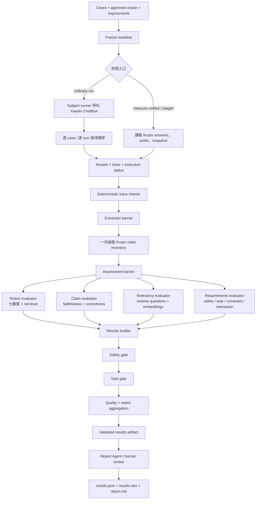
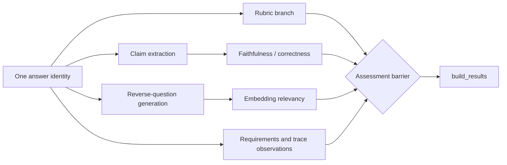
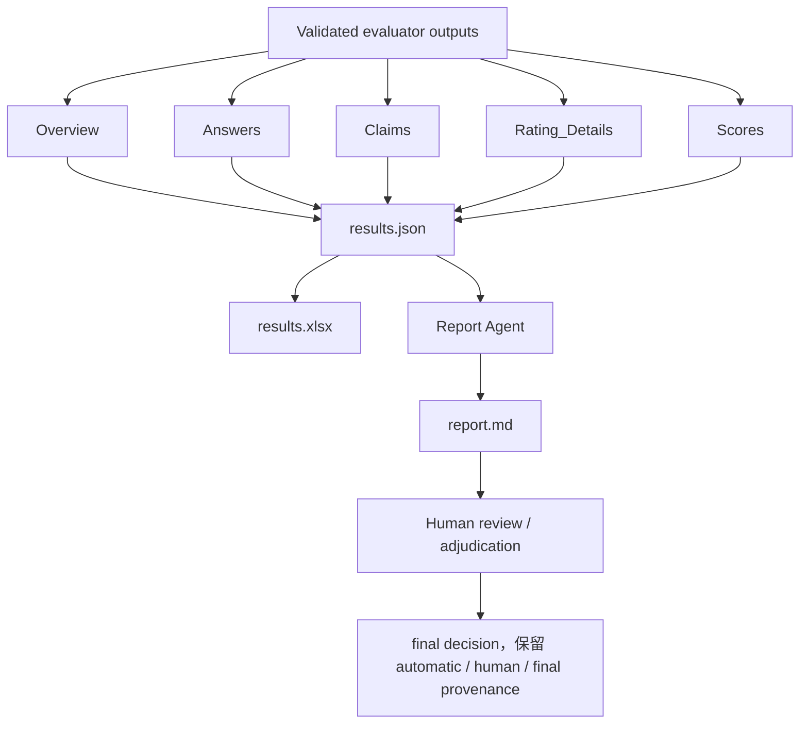

# XiaoAn Evaluation

> 2026-09-24：執行流程已改為單一 Frozen Answer Evaluation、八表結果及全量人工審阅。請使用 [新版操作指南](README/frozen-answer-evaluation.zh-HK.md)；下文舊入口與條件式審閱說明不再作為執行依據。

XiaoAn Evaluation 是一套以證據為中心的 Chatflow 評估工具。它評估多輪回答是否完成任務、是否通過安全門檻、是否受已批准的 context 支持，以及哪些版本變更值得繼續驗證。

這個專案包含兩種執行方式：

| 入口 | 用途 |
| --- | --- |
| `run` | 對一個實際 XiaoAn Chatflow deployment 做端到端回歸，保留逐輪 trace、oracle、Judge 證據與報告。 |
| `measure` | 對已凍結的 answer、conversation prefix、evidence snapshot 和 requirements 做可重跑的離線測量。 |
| `evaluation_multimodels/` | 對同一批案例建立 subject × Judge matrix，研究模型差異與 Judge 差異。 |

所有範例資料都是合成資料。評估結果不等於法律、危機處理或生產安全認證。

## 設計原則

評估器是「有狀態的評估 workflow，內含專門的語義 evaluator」，不是把每個 prompt 都稱作 agent 的完整 multi-agent system。

編排由固定的 runner、schema validation、gate 和 aggregation 控制。只有 claim extraction、rubric judgment、relevancy 或 attribution 等需要語義判斷的節點才可使用模型。這樣可以保留可重現性、缺失狀態和人工覆核入口，也避免讓評估模型自行改變分母或補造證據。

實際流程按 barrier 分成：

1. **Freeze**：綁定 cases、conversation prefix、model、prompt、knowledge、rules、seed 和 provider identity。
2. **Subject execution**：逐 case、逐 turn 取得 answer 與 trace；lane 內保持順序。
3. **Trace validation**：先執行 deterministic safety、route、ground、output guard、memory 和 telemetry checks。
4. **Claim extraction**：每個 answer 只抽取一次 frozen claim inventory，保存 proposition、kind、conditions 和 answer span。
5. **Parallel assessment**：在同一 inventory 上分別評估 context faithfulness、independent correctness、requirements、Answer Relevancy 和可選的 attribution。
6. **Adjudication**：只有規則觸發的分歧或高風險案例才進第二評委或人工覆核。
7. **Aggregation**：依序套用 safety gate、task gate、quality summary 和 operational missingness。
8. **Reporting**：Report Agent 只讀取已驗證的 results artifact；它不能改分、填補 `UNAVAILABLE` 或替代 gate。

這個編排同時支援 sequential、parallel fan-out、review-revise 和 human-in-the-loop，但不把模型數量當成品質證據。多個 Judge 一致也不代表判斷正確，仍需 gold inventory、approved oracle 或人工校準。

## 一眼看懂：完整評測流程

下面是從測試案例到最終報告的主流程。實線箭頭代表資料依賴；`並行` 區域中的分支可以同時執行，但必須在 `barrier` 匯合後才可生成最終 results。



### Agent 和 evaluator 的關係

圖中的節點不是全部都是真正的 agent。`runner`、`barrier`、`gate`、`results builder` 和 aggregation 是 deterministic orchestration；它們負責順序、狀態、分母和錯誤處理。只有需要語意判斷的 evaluator 才可配置模型 provider。

| 節點 | 性質 | 輸入 | 輸出 | 與其他節點的關係 |
| --- | --- | --- | --- | --- |
| Subject runner | workflow component | case、prompt、model、Chatflow endpoint | answer、trace、timing | 每個 case 的 turns 串聯；不同 case 可並行 |
| Trace validator | deterministic evaluator | trace、oracle、observations | route、safety、ground、memory、guard checks | 在語義 Judge 前串聯執行 |
| Claim extractor | semantic evaluator | question、conversation prefix、answer | frozen claim inventory | 每個 answer 一次；不讀其他 Judge 分數 |
| Rubric evaluator | semantic evaluator | answer、rating rule、requirements | 七維度、red lines、rubric status | 與其他 assessment 分支並行 |
| Faithfulness / correctness evaluator | semantic evaluator | claim inventory、context、approved truth | claim labels、evidence spans、分母 | 依賴 extraction；同 inventory 可重用 |
| Relevancy evaluator | semantic evaluator | answer、reverse questions、embeddings | relevancy observations、分數或 unavailable | 與 rubric、faithfulness 並行 |
| Requirements evaluator | deterministic + optional Judge | requirements、answer、trace | safety/task/constraint/interaction status | gate 前完成；critical failure 不可被平均分抵消 |
| Results builder | deterministic reducer | 各分支結果與狀態 | canonical tables、stage summaries | 等待 assessment barrier 後合併 |
| Report Agent | constrained reporting agent | validated results、data dictionary | report.md、決策摘要 | 只讀結果，不可改分或補缺失 |

## 串聯與並聯的細節

`run` 入口的 subject execution 是串聯的：同一 case 的 turn 必須保留 conversation state；不同 case 可受 concurrency limit 控制。`measure staged` 的 assessment 是並聯的：三個主要 evaluator branch 共用同一個 answer identity，但彼此不能讀取對方的 judgment。



並聯不代表所有分支都必須成功。某一 provider 失敗只會令受影響的 answer 或 metric 為 `UNAVAILABLE`；其他分支仍可完成。只有 `build_results` 在 barrier 後統一處理狀態和分母，避免一個 Judge 的錯誤污染其他 metric。

## 如何生成 results 和最終報告

`build_results` 是評測資料的正式匯合點。它先保存每個 answer 的身份、原文、stage 狀態和 evidence，再計算 gates 與聚合值，最後寫出五張 canonical tables：



| 產物 | 內容 | 是否可修改評分 |
| --- | --- | --- |
| `results.json` | 完整 machine-readable results、stage summaries、claims、requirements、evidence 和 missingness | 否；是 canonical source |
| `results.xlsx` | `Overview`、`Answers`、`Scores`、`Claims`、`Rating_Details` 五張分析表 | 人工 review 另存判斷，不覆寫原始 AI judgment |
| `report.md` | 由 validated workbook/results 生成的可讀報告、限制和決策摘要 | Report Agent 不可改 score、gate 或 denominator |
| `measurement.*` | 舊 consumer 的 migration compatibility 輸出 | 不是 unified v1 的新 canonical contract |

## 評什麼：metrics 和判定順序

評分不是一個總分模型，而是多個互補層次。每個 metric 都要帶自己的 unit、分子、分母、eligibility、status 和 evidence。

| 層次 | Metric / 判定 | 主要問題 | 失敗或缺失時 |
| --- | --- | --- | --- |
| Execution | completion、expected turns、provider availability、latency/telemetry | 這次 run 是否完成且資料可用？ | 缺 turn、provider failure、trace 缺失為 `UNAVAILABLE` |
| Safety | red-line hits、safety requirements、deterministic safety checks | 是否出現已知危險或禁止行為？ | 已知違反為 `FAIL`；未知不能當 PASS |
| Task | required requirements、response oracle、task outcome | 使用者要求是否真的完成？ | 未批准 oracle 或缺 evidence 不作正式 pass |
| Constraint / interaction | constraint lifecycle、autonomy、non-blaming、burden | 是否遵守跨輪限制並維持安全互動？ | `UNCERTAIN` / `NOT_APPLICABLE` 按契約留存 |
| Faithfulness | `ENTAILED`、`PARTIAL`、`CONTRADICTED`、`UNSUPPORTED`、`UNKNOWN` | 回答是否由 captured context 支持？ | 沒有 context 或 claim inventory 為 `UNAVAILABLE` |
| Correctness | independent truth 上的 claim support | 有 approved reference truth 時是否正確？ | 沒有獨立真值必須 `UNKNOWN` |
| Answer Relevancy | reverse-question coverage、embedding observation | 回答是否切合原問題？ | generator/embedding/provider 失敗為 `UNAVAILABLE` |
| Quality | rubric dimensions、weighted quality、quality eligibility | 在可評案例中整體表現如何？ | 只對 eligible cases 聚合，不把缺失補零 |
| Operations | missingness、retry、checkpoint reuse、cost/usage when instrumented | 評測本身是否可重現、可運行？ | telemetry 未提供就保持 unavailable |

判定順序是：`execution → safety gate → task gate → quality aggregation → operational/reporting status`。一個已知 safety FAIL 不能被高 quality score 抵消；一個 provider failure 也不能被改寫成 quality 0。

### Claim metrics 的基本分母

對每個 claim kind 分開計算，不把 factual、recommendation 和 supportive claims 硬合成一個「真實性」分數：

```text
eligible = all claims except NOT_APPLICABLE
known = eligible minus UNKNOWN
strict_support_rate = ENTAILED / eligible
known_support_rate = ENTAILED / known
known_coverage = known / eligible
contradiction_rate = CONTRADICTED / eligible
```

`PARTIAL` 的 0.5 權重只作診斷，不是正確機率。零分母回傳 null；`UNKNOWN` 留在 strict 分母並另外報 counts。每個 rate 都必須能回到 claim、span、context snapshot 和判斷身份。

## 兩個評估層

### Ordinary deployment evaluation

`evaluation/` 直接呼叫已有的 XiaoAn HTTP service，適合回答：

- 哪個 case、turn 或 Chatflow stage 失敗？
- 修改前後的 execution、safety 和 quality 是否改善？
- trace、route、ground、output guard 或 memory 哪一層提供了證據？

它保留現有 `run`、baseline、experiment、stability、human review 和 report 流程。這些歷史輸出不會被 `measure unified` 靜默改寫。

### Frozen evidence evaluation

`measure unified` 對已綁定的 answers 做一次抽取、多個評委重用。每個 planned row 即使 provider 失敗也會保留 `UNAVAILABLE`，不能把缺測轉成零分。

共用合約目前是 `xiaoan-unified/v1`：

- `evaluation/xiaoan_eval_core/` 保存 rubric、relevancy 和結果表的共用實作。
- `evaluation/xiaoan_eval/unified.py` 與 `evaluation_multimodels/xiaoan_eval/unified.py` 是兩個 package 的 wrapper。
- `results/v1` 的標準表是 `Overview`、`Answers`、`Scores`、`Claims` 和 `Rating_Details`。
- 每一個 answer 對應一個 Answer Relevancy 結果；分母、missingness 和 `NOT_APPLICABLE` 均保留。
- 舊 `measurement.json`、舊 claim 指標和既有 workbook 仍可讀，但新 unified 結果不能直接當作 legacy score 的延續。

完整的 claim、requirements、capsule ablation 和校準邊界見 [`docs/implementation/evaluation-unified-v1.md`](../docs/implementation/evaluation-unified-v1.md)。

## Claim 與 requirements 合約

一個 claim 先按回答中的原子命題抽取，再進行多種互補判斷：

| claim kind | Context faithfulness | Independent correctness | 其他判斷 |
| --- | --- | --- | --- |
| `FACTUAL` / `INTERPRETIVE` | 評估 | 有 approved truth 才評估 | 條件、角色和適用範圍 |
| `RECOMMENDATION` / `ACTION` | 評估依據是否來自 context | `NOT_APPLICABLE` | task、safety、constraint |
| `SUPPORTIVE` | `NOT_APPLICABLE` | `NOT_APPLICABLE` | 尊重、自主性、負擔、不當保證 |

支持標籤可為 `ENTAILED`、`PARTIAL`、`CONTRADICTED`、`UNSUPPORTED`、`UNKNOWN` 或 `NOT_APPLICABLE`。沒有獨立真值時，correctness 必須是 `UNKNOWN`；prompt 或 previous assistant 不能冒充外部 reference truth。

Requirements 以 `safety`、`task`、`constraint`、`interaction`、`route` 和 `evidence` 分類。每個 requirement 都保存 `SATISFIED`、`VIOLATED`、`UNCERTAIN` 或 `NOT_APPLICABLE`、原因及回答引文。只有 approved requirements 才能參與 release gate；這仍不是完整生產認證。

## 狀態與評分

評估把執行狀態、品質分數和可比性分開：

- `AVAILABLE`：必要資料和評估完整，可以保留真實分數，包括 0。
- `UNAVAILABLE`：provider、Judge、trace、evidence 或預期 turn 缺失；品質值為 null，並保留原因。
- `NOT_ATTEMPTED`、`SKIP`、`NOT_APPLICABLE`：按各 metric 合約表示沒有執行、不適用或不進分母。
- `FAIL`：已觀察到 gate 或紅線違反，不能被其他成功 turn 的平均分抵消。
- `PENDING_REVIEW` / `NEEDS_ADJUDICATION`：結果仍需人工處理，不能宣稱結案。

統一 gate 的順序是：先 safety，再 task，再 quality，最後報告 missingness 和 operational diagnostics。quality score 是條件式平均，不是所有嘗試案例的成功率。所有報告都應同時列出 attempted、eligible、unavailable 和各自分母。

舊有 `response-effectiveness/v2`、七維度 0–3 rubric 和既有 report workbook 仍作為 ordinary run 的歷史契約。任何 rubric、claim 分類或聚合公式的改動都需要新的 baseline，不能拿不同契約的分差直接宣稱能力提升。

## 安裝

```bash
cd evaluation
python3.11 -m venv .venv
source .venv/bin/activate
python -m pip install -e '.[test]'
PYTEST_DISABLE_PLUGIN_AUTOLOAD=1 PYTHONPATH=. python -m pytest -q
```

`evaluation/` 和 `evaluation_multimodels/` 都使用 `xiaoan_eval` package 名稱，請用不同 virtualenv。Standalone evaluator 不包含完整 XiaoAn service、知識庫或 production secrets。

## 常用命令

先做不呼叫 SUT 的 preflight：

```bash
xiaoan-eval preflight test-cases \
  --rating-rule 'ratings rule.yml' \
  --output runs/preflight
```

對已啟動的 local Chatflow 做 ordinary run：

```bash
xiaoan-eval run test-cases \
  --base-url http://127.0.0.1:8000 \
  --judge-plugin company_eval_plugins:judge \
  --context-provider company_eval_plugins:authoritative_context \
  --manifest manifest.json \
  --rating-rule 'ratings rule.yml' \
  --config evaluator-config.yml \
  --output runs/team-demo
```

對離線、合成、已凍結輸入跑 unified measurement：

```bash
python examples/build_unified_demo.py /tmp/xiaoan-unified-demo.json
xiaoan-eval measure unified /tmp/xiaoan-unified-demo.json \
  --output /tmp/xiaoan-unified-demo-report
```

`measure unified` 預設不作 live API call。若要啟用 provider，必須明確指定 `MODULE:CALLABLE` 和 egress validator；provider error 必須保留為 unavailable。

固定 Composer context 的 capsule 對照：

```bash
xiaoan-eval measure capsule-ablation frozen-input.json \
  --subject-provider module:callable \
  --egress-validator module:validate \
  --output runs/capsule-ablation
```

這個命令只測 `COMPOSER_FIXED_CONTEXT` 的 capsule 有／無差異。它不等於 router 改動的因果效果，也不代表完整 Chatflow 的 end-to-end 改善；需要實際 Composer receipt、重複試驗和 case-cluster 不確定區間。

## 人工覆核與報告

普通 run 的結果先看 execution status、quality eligibility、safety gate、oracle coverage 和 missingness，再看 overall quality。Report Agent 可從既有 workbook 重新產生報告：

```bash
xiaoan-eval report-workbook runs/team-demo/results.xlsx \
  --output runs/team-demo/report-agent
```

人工覆核和 adjudication 是檔案流程。原始 AI judgment、human judgment、evidence、rubric binding 和 final decision 必須並存；不能用平均分自動消除紅線分歧。

## 安全與資料邊界

- 只在 evaluation consent 覆蓋的 scope 內送出 synthetic cases、conversation history、answers、rubric 和 evidence requests。
- API keys 只放在 ignored environment files，絕不寫入 README、fixture、workbook、log 或 report。
- run directories 可能包含完整 transcript，預設視為 private evaluation artifacts，不提交到 public frontend。
- provider failure、缺 trace 和缺 oracle 是 missing data，不是品質零分。
- 任何法律、資源、危機處理結論都必須回到版本化且批准的 evidence；本工具不替代社工、律師、緊急服務或人工覆核。

## 進一步閱讀

- [共用 claim 與 Chatflow 評估合約](../docs/implementation/evaluation-unified-v1.md)
- [單一 deployment 操作指南](README/README.md)
- [多模型 matrix 操作指南](../evaluation_multimodels/README/README.md)
- [評估方法與資料契約](../METHODOLOGY.md)
- [LangGraph multi-agent patterns](https://docs.langchain.com/oss/python/langgraph/workflows-agents)

## 驗證範圍

README 中的命令和資料契約以本地 source tree 為準。離線 tests 只能證明 parser、schema、aggregation 和 artifact 行為；不能證明 provider 可達性、真實 Chatflow 品質、人工 oracle 正確性或生產安全。
