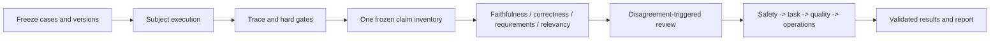

# XiaoAn Evaluation｜共同設計指南

這份文件是 `evaluation/` 與 `evaluation_multimodels/` 的共同設計基準。入口命令、最新資料契約和安全邊界以 [`evaluation/README.md`](README.md) 為準；本文件保留兩個 project 都必須遵守的架構與解釋規則。

## 評估不是排行榜

XiaoAn 是多輪 Chatflow。一次回答可能涉及危機辨識、route、Capsule、ground、memory、Composer、output guard 和下一輪 state。答案相似不代表路徑相同，答案流暢也不代表已完成安全與任務要求。

因此每個結論都必須回到：

1. versioned case、oracle 和 requirements；
2. 實際 answer、conversation prefix 和 trace；
3. 可定位的 evidence spans、snapshot 和 provider 狀態；
4. 明確的分母、缺失政策和可比性契約。

## 編排模型

整體是 deterministic orchestration 加上有限的 evaluator ensemble。runner、barrier、gate、cache 和 aggregation 具有明確狀態；語義模型只在需要判斷的節點工作。

這個設計可以使用 sequential pipeline、parallel fan-out、review-revise 和 human-in-the-loop。它不把模型數量當成 multi-agent 證據，也不把 Judge agreement 當作 truth。只有當一個節點有獨立 decision boundary、受約束的 state、輸出契約和明確的 handoff，才應稱為 agentic evaluator。

## 共用 claim lifecycle

一個 answer 先建立 immutable identity：subject、case、turn、prefix hash、answer hash、snapshot hash、prompt 和 model version。之後只抽取一次 claim inventory，再讓不同評委重用它。

Extractor 不看其他 Judge 分數，也不能自行引入 evidence。每項 claim 保存：

- `id`、`kind`、`proposition`；
- `conditions`、角色與適用範圍；
- answer 中的 Unicode `start`、`end` 和原文 span；
- extraction status、error reason、inventory hash。

評委分開輸出 context faithfulness、independent correctness、task、constraint、interaction 和安全判斷。多段 evidence 必須判斷聯合支持；不能把每段 PARTIAL 相加成看似精確的機率。

## Claims、requirements 與分母

`FACTUAL` 和 `INTERPRETIVE` claims 需要 approved truth 才能做 independent correctness；`RECOMMENDATION` 和 `ACTION` 主要評估 context、task 和 safety；`SUPPORTIVE` 不納入 factual correctness 分母。

支持結果包括 `ENTAILED`、`PARTIAL`、`CONTRADICTED`、`UNSUPPORTED`、`UNKNOWN` 和 `NOT_APPLICABLE`。`UNKNOWN` 仍保留在 strict 分母，零分母回傳 null。`UNSUPPORTED` 代表評估完成後沒有支持，`UNKNOWN` 代表資料或判斷本身不足。

Requirements 分為 `safety`、`task`、`constraint`、`interaction`、`route` 和 `evidence`。多輪 constraint 需要 start/end lifecycle；不能把一輪的限制永久套到後續所有輪次。沒有可用 observation 時，Judge 不得捏造 pass 或 fail。

Release gate 只對 approved requirements 生效：safety 和 critical requirements 先過，接著 task 和 constraint，再看 quality。未知或缺測保持 unavailable；此 gate 不是完整產品 certification。

## 狀態優先於分數

`AVAILABLE` 才能產生品質數值；真實 0 保留為 0。`UNAVAILABLE`、`NOT_ATTEMPTED`、`SKIP`、`NOT_APPLICABLE` 和 `PENDING_REVIEW` 不能被轉成 0、PASS 或「沒有問題」。

每份報告都應列出 planned、attempted、available、unavailable、eligible 和 excluded 分母。execution success、safety pass、task completion、quality average 和 provider availability 是不同指標，不能混成一個總分。

## Matrix 與 self-judging

Matrix 先完成每個 subject lane 的全部 turns，再讓多個 Judge 評同一份 immutable answer。subject、case 和 turn lane 可並行，lane 內保持 session 順序。成功 checkpoint 可重用，但 identity、prompt、model、snapshot 和 rubric binding 不一致時必須拒絕。

同一 model family 的 self-judging cell 保留原始結果，但排除主要 Judge 分母。不同 alias 不自動代表獨立真值，也不能跨 subject 或 Judge 任意合併排行榜。

## Capsule ablation 邊界

`measure capsule-ablation` 只允許一個干預：固定 Composer context 中的 capsule units 有／無。model、provider、system prompt、sampling、seed、route、history 和其他 context 都要綁定。

它測的是 `COMPOSER_FIXED_CONTEXT`，不是 router、knowledge selection 或完整 Chatflow 的因果效果。不同回答的 claim 分母可能不同，因此支持率差只是診斷；正式推論需要重複試驗、case cluster 和不確定區間。

## Report Agent 邊界

Report Agent 讀取已驗證的 workbook、results JSON 和 data dictionary，負責把結果轉成可讀的 decision report。它不能：

- 更改 score、gate、eligibility 或 denominator；
- 把 `UNAVAILABLE` 補成 0 或 pass；
- 從 route 或 prompt 推造 claim provenance；
- 把建議寫成已驗證的因果結論。

Report failure 應保留原始 machine-readable result，方便離線重試。

## 版本與遷移

普通 `run` 的 `response-effectiveness/v2`、七維度 rubric 和舊 workbook 是歷史契約。`xiaoan-unified/v1` 是明確選用的第二階段入口，不會靜默重算歷史報告。

新合約輸出的 canonical tables 是 `Overview`、`Answers`、`Scores`、`Claims` 和 `Rating_Details`。舊 measurement artifacts 保留作 migration compatibility；使用新 claim taxonomy、requirements 或聚合公式時，必須建立新的 baseline。

## 研究與限制

Evaluation workflow 可以借用 supervisor、parallel fan-out、review-revise 等 multi-agent patterns，但產品評估的可靠性來自 state、版本、barrier、證據和人工校準，不是 agent 數量。

尚未完成或不能由離線測試證明的部分包括：真實 provider 可達性、live Chatflow adapter receipt、approved gold inventory、語義抽取 recall、情境化 rubric、人類 benchmark、成本和人口級 safety recall。
