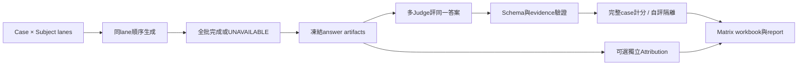

# evaluation_multimodels｜Subject × Judge 交叉評估

**2026-09-13 · scoring `response-effectiveness/v2` · 專用 matrix workbook**

本 project 將相同 case 的凍結答案交给不同Judge，分離subject表現、Judge尺度、自評及provider缺失。它提供direct model與完整Chatflow兩種subject transport；兩者不是同一評估對象。普通run仍可用，操作見 [evaluation](../../evaluation/README/README.md)。

完整設計、公式與能力邊界：[Shared Guide](../../evaluation/README_SHARED.md)。本次修復：[v2測量契約](measurement-contract-v2.zh-HK.md)。

## 1. 核心流程



每個answer identity固定，Judge不能重新生成subject答案。跨case/subject可並行，conversation內不並行。失敗lane/cell保留原因，其他可用觀察繼續保存；整案缺輪不進完整case總分。

## 2. 安裝

```bash
cd evaluation_multimodels
python3.11 -m venv .venv
source .venv/bin/activate
python -m pip install -e '.[test]'
PYTEST_DISABLE_PLUGIN_AUTOLOAD=1 PYTHONPATH=. python -m pytest -q
```

與evaluation分開virtualenv，兩者CLI及import名稱相同。實際Chatflow與知識服務需另行部署，standalone repo不包含它們。Provider設定讀本機environment／`.env`；不要將credentials、私有trace或runs上傳Git。

## 3. Registry與case選擇

預設10subjects（五provider×latest/second）及5Judges。這是程式registry，不保證model仍為市場最新或provider可用；使用 `--subjects`、`--judges` 固定本次真正model IDs、tier與reasoning_effort，可跑5×5。

JSON檔是ModelSpec object array；以下是**格式示例**，`YOUR_AVAILABLE_MODEL_ID`須替換：

```json
[{"provider":"gpt","model":"YOUR_AVAILABLE_MODEL_ID","tier":"latest","reasoning_effort":"medium"}]
```

默認正式cases為74案217輪，REVIEWED不等於APPROVED_AGGREGATE。response oracle=0、memory僅6個use。九份proposed草案不自動載入，不把未批准草案算進正式品質／能力覆蓋。

## 4. 執行模式

### A. 完整Chatflow mode

```bash
xiaoan-eval matrix test-cases \
  --subject-transport company_eval_plugins:xiaoan_chatflow_transport \
  --judge-transport company_eval_plugins:multimodel_transport \
  --subjects private/subjects.json --judges private/judges.json \
  --rating-rule 'ratings rule.yml' \
  --subject-concurrency 2 --judge-concurrency 3 \
  --max-in-flight 3 --per-provider-concurrency 1 \
  --output runs/team-matrix
```

`XIAOAN_CHATFLOW_BASE_URL`指向endpoint。Adapter透過POST `/v1/conversations`建立session，再POST `/v1/conversations/{id}/responses`，傳debug、router/response model override及reasoning_effort。它比較整體Chatflow配置；不是只換Composer的因果實驗。

### B. Direct model mode

將subject transport改為 `company_eval_plugins:multimodel_transport`。此模式直接發prompt到provider，測的是給定上下文的模型回答，不能宣稱覆蓋Chatflow路由、knowledge或session。Judge仍使用judge transport。

外部model/endpoint availability、權限與計費須以執行環境為準。README中的command只代表已存在的CLI/插件接口，不表示已完成本次live run。

## 5. 併發與checkpoint

CLI預設subject2、Judge3、全局in-flight3、每provider1。呼叫量約subjects×turns加subjects×judges×有效turns，另計retries／attribution。時間與費用不能只看最後成功一次；保留attempt count、retry error、tokens及cache telemetry，缺值不補0。

```bash
# 在原有相同cases/models/rule/transport/output參數上加入
xiaoan-eval matrix test-cases \
  --subject-transport company_eval_plugins:xiaoan_chatflow_transport \
  --judge-transport company_eval_plugins:multimodel_transport \
  --subjects private/subjects.json --judges private/judges.json \
  --resume --retry-unavailable --output runs/team-matrix
```

checkpoint默認在相鄰私有`.matrix-audit`，可用 `--checkpoint`另指定。只重用契約相容結果；v2 hash納入scoring version。`--allow-legacy-checkpoint`不是公式升級方法，不能用來混合舊分數。

## 6. 計分與自評

逐維度整數0–3；focus乘1.5後對全部七維度歸一化。每輪加權，完整case平均；紅線優先，case任何一輪紅線命中則case0。必要輪次/provider/Judge缺失→UNAVAILABLE/null。Cell先按完整case聚合，再case-macro mean；長案例不額外增權。

維度表使用有效turn median，與cell的weighted case mean是不同統計。合成 `[0,0,3]` 同案的總分=1、維度median=0；Markdown／Excel相同。

同provider/model自評預設排除主要分母，仍列出供診斷。`--no-isolate-self-judging`才明確納入；agreement仍用non-self。自評隔離不保證節省呼叫。不同subject排除自己的Judge後panel可能不同，不能直接視為公平能力排行榜。

Matrix的PASS是cell執行／解析成功，不等於ordinary quality threshold PASS；正式品質閾值與oracle批准要按各流程契約解讀。

## 7. 描述統計與校準

| 指標 | 定義／解讀 |
| --- | --- |
| median / MAD / IQR / range / n | 逐維度分布、離散程度和樣本數 |
| ordinal alpha | 同unit的序位評分一致；De=0或不足→UNAVAILABLE |
| nominal alpha | 紅線二元一致；常數標籤不是完美校準 |
| Kendall W | 同case/turn內subjects排名一致；不插補缺rank，panel不完整或退化→UNAVAILABLE |
| Spearman rho | 兩Judge共同units的pooled排序相關，可能混入case難度 |

全部為DESCRIPTIVE_ONLY，不能證明Judge正確。5×5去自評對角線通常已不是完整共同panel，所以W不可用可以是誠實結果。正式比較需共同獨立panel、凍結人類benchmark、red-line sensitivity、維度／claim誤差與漂移追蹤。

Pairwise helper存在，但完整CLI／正式版本勝率與上下文契約尚未完成；不要把LEFT/RIGHT勝率直接當A/B版本勝率。

## 8. Matrix workbook與report

| Sheet | 首要用途 |
| --- | --- |
| Matrix | subject×Judge完整case加權macro mean |
| All_Answers | 同一answer原文、identity、trace hash、provider與timing/token/cache/errors |
| All_Judgements | Judge回應、維度、紅線、primary eligibility、錯誤 |
| Dimension_By_Judge | 維度median；總分欄沿用case-macro；count欄是turn數 |
| Oracle_Coverage | authored vs reviewed，零reviewed不宣稱已測量 |
| Self_Judging_Isolated | 自評觀察獨立列示；是否納入仍看primary_eligible |
| Measurement_Contract | 分母、memory／attribution狀態與摘要 |
| Judge_Agreement／Red_Line_Agreement | 一致性、有效樣本與缺失／退化資訊 |
| Dimension_Statistics | raw score分布、median/MAD/IQR/range/n |

Matrix正式pair仍是results.xlsx/report.md，但**不是ordinary schema2.1 workbook**，不能直接交ordinary human-review或baseline reader。跨matrix診斷工具 `tools/compare_matrix_runs.py` 的結果也不能自動當作已批准因果／release結論。

## 9. Memory與歸因

Memory observer支援remember/retrieve/use/not_use/update/isolation/stale/unsafe；缺telemetry SKIP，正確不用可PASS。Matrix summary提供lifecycle、fact retrieval P/R及污染。Genericflags是較弱證據，跨session isolation仍需harness。

`--attribution-judge-plugin module:callable`是可選，需符合獨立attribution契約與effective_context_snapshot。保留answer/evidence spans、refs與各層；ENTAILS1、PARTIAL0.5、其他0。路由選中、內容注入、語義支持和因果依賴是四層不同證據。

## 10. 驗證與限制

v2本機完整測試292 passed；發布前亦在standalone clone驗證。測試是軟體回歸，不是292次live評測。缺少approved response/task oracle、部分memory遙測、真正工具outcome與公平共同Judge panel時，報告必須顯示限制。完整版本、校準、診斷及下一步見Shared Guide。
