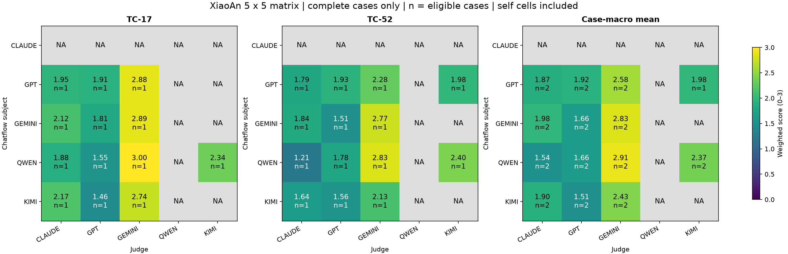

# TC-17／TC-52：5×5 試跑、重試與穩定度結論

已完成兩案完整 Chatflow 試跑、一輪 unavailable 重試、固定答案 Judge 重評，以及重評失敗的補試。**缺失仍然存在；這是實測結果，不補零、不挑最高分。**

## 1. 執行結果

| 階段 | 成功回答 | 有效逐輪品質評分 | 說明 |
|---|---:|---:|---|
| 第一輪 | 27/30 | 95/150 | 5 subjects × 6 turns × 5 Judges |
| 重試後 | 26/30 | 99/150 | 失敗的 stateful lane 必須整段重跑，因此回答可用數未必增加 |
| 固定答案首次重評 | 沿用同一批答案 | 82/99 | 只重評99個有效基準cells；51個缺基準者不發新重評請求 |
| 重評失敗補試後 | 沿用同一批答案 | 93/99 | 11個恢復，6個仍不可用 |

主矩陣剩餘51個逐輪缺失：Claude 的4個回答失敗導致20個Judge cells無法評；Qwen Judge另有26個連線失敗；Kimi Judge另有5個連線失敗。HTTP adapter 的 PROVIDER_5XX 標籤不保證錯在上游：本機日誌確認部分Claude失敗是router JSON解析錯誤。

完整case聚合後，25格中14格有分數。Claude兩案都缺輪，所以subject整行NA；Qwen Judge整欄NA。GPT subject × Kimi Judge只包含TC-52（n=1），其餘有效格n=2；不要直接把不同case組成的均分排成模型排行榜。

## 2. 兩案及合併的5×5矩陣

分數0–3；n是有效完整case數。自評對角線保留；穩定度另外提供排除自評的結果。

## 3. 同一Judge重評同一答案，穩定度如何？

主要統計採首次重評的82個有效配對，避免補試成功篩選掩蓋原始可用性。模型ID、問題、歷史、答案、rubric及新版oracle契約固定；本輪本機程式與內容hash複核沒有變更。服務端模型版本仍無法核實，執行逾時／重試／併發設定變更有保留。

| Judge | 配對cells | 逐維度完全一致 | 整組7維完全一致 | 維度MAE | 加權分MAE |
|---|---:|---:|---:|---:|---:|
| claude | 24 | 76.2% | 41.7% | 0.399 | 0.319 |
| gpt | 21 | 68.7% | 0.0% | 0.333 | 0.258 |
| gemini | 25 | 79.4% | 48.0% | 0.217 | 0.158 |
| qwen | 0 | NA | NA | NA | NA |
| kimi | 12 | 82.1% | 25.0% | 0.179 | 0.164 |
| all | 82 | 76.1% | 30.5% | 0.294 | 0.232 |
| non_self | 67 | 75.9% | 29.9% | 0.301 | 0.248 |

**存在可觀測的重評波動。** 逐維度76.1%一致，但整組7維只有30.5%完全相同；96.3%的逐維度分差不超過1分。逐輪加權分平均絕對差為0.232／3。補試後93個配對的加權分MAE為0.219、逐維度一致率77.6%，另見Excel，不能替代第一輪可用性。

最大分歧集中於法律維權（MAE 0.463）及求助轉介（0.402）；表達能力MAE僅0.024。例如TC-17第1輪、GPT subject的同一答案，Claude Judge在法律維權及求助轉介均由0分改為3分。TC-17第2輪Kimi subject亦有同樣現象。這支持優先檢查「本輪是否適用該維度」的rubric解讀，但分數本身不能證明哪次才正確。

82個配對沒有紅線有/無翻轉；但兩次均沒有紅線陽性判定，屬退化樣本，**不能據此宣稱紅線檢出可靠**。本輪只有兩個case，多輪及多Judge不是獨立樣本；case-cluster區間留在結構化資料中，不作母體推論。

## 4. 不同Judge的尺度

在四個可用Judge共同評到、且先前對話輪次完整的19個回答上，以下是同一組回答的平均加權分（含自評）：

| Judge | 共同回答n | 平均分 | 其中自評n |
|---|---:|---:|---:|
| claude | 19 | 1.872 | 0 |
| gpt | 19 | 1.715 | 5 |
| gemini | 19 | 2.757 | 4 |
| kimi | 19 | 2.338 | 4 |

Gemini在這個共同樣本的平均分比GPT高約1.04／3。這是尺度差異；沒有人工gold，不能認定誰較正確。不同Judge與同Judge重評是不同問題，不能用跨Judge一致性代替重評穩定度。

## 5. 與歷史runs比較：XiaoAn回答的穩定度

以下按case／turn／subject model配對，要求兩邊先前輪次都成功；不拼接不同對話歷史。歷史Judge prompt／oracle／計分契約不同，因此評分差屬跨版本診斷，不能分解為純Judge噪音或產品改善。舊維度值另按目前權重重算，原始已發布分数保留在Excel。

| 歷史run | 有效回答配對 | 文字完全相同 | 路由一致 | 同一已記錄Composer請求hash的配對 | 歷史Judge配對cells | 維度MAE |
|---|---:|---:|---:|---:|---:|---:|
| matrix-tc17-tc52-all-judges-20260908-r1 | 6 | 0.0% | 83.3% | 5 | 12 | 0.560 |
| matrix-tc17-tc52-latest-20260906223910 | 0 | NA | NA | 0 | 0 | NA |
| matrix-tc17-tc52-latest-20260906225147 | 17 | 0.0% | 58.8% | 10 | 55 | 0.649 |
| matrix-tc17-tc52-latest-selfeval-20260909030335 | 18 | 0.0% | 72.2% | 13 | 61 | 0.382 |
| matrix-tc52-5x5-retry-20260912200358 | 0 | NA | NA | 0 | 0 | NA |
| matrix-tc52-5x5-retry-20260912200446 | 0 | NA | NA | 0 | 0 | NA |
| matrix-tc52-5x5-retry-20260912200628 | 8 | 0.0% | 62.5% | 5 | 29 | 0.680 |
| matrix-tc52-5x5-retry2-20260912223848 | 8 | 0.0% | 75.0% | 6 | 18 | 0.413 |

對照9/09兩案run：18個有效回答配對中，文字完全相同為0，路由一致13/18（72.2%）。其中13個具有相同的已記錄Composer請求hash，回答文字仍全部不同；這比只按case ID配對提供更強的输入控制，但未記錄wire參數與服務端版本仍未知。

對照9/12 20:06的TC-52完整回答run：8個有效配對，路由一致5/8（62.5%）；對照較晚22:38 run則為6/8（75.0%）。這兩組都不是新的獨立case樣本，不把它們相加當作更大的n。已觀察配對的安全等級標籤均相同，但粗略label不代表具體建議安全性相同。

**措辭有變不等於品質有變，部分變化則超過措辭。** TC-52的GPT/Kimi配對仍維持否定自責、承認現實障礙的核心方向；TC-17的Qwen由n1b轉為baseline/n2後，新增清除記錄／無痕模式等指令，需要針對數位安全oracle覆核其內部一致性。詳見[具體文本核對](../qualitative-notes.zh-HK.md)及Excel原文雙欄。

## 6. 語意oracle的實際限制

主矩陣99個品質有效cells中，只有36個語意oracle通過結構、binding及span校驗。首次固定答案重評只取得17個語意有效cells；補試後為21個。常見問題是引文位置與原文不符、binding/shape不符。七維度分數有效不代表語意task verdict有效。

只有8個cells／32個oracle items在首次配對中兩邊都有效，31/32標籤相同。這個96.9%是高度篩選後的小樣本，**不能宣稱整體語意Judge穩定或正確**。第二次固定答案評估已為有有效品質基準、但原本語意缺失的cells提供補試觀察；仍無有效結果者保持unavailable。

## 7. 交付與可重現性

- [主矩陣Excel](../fresh/results.xlsx)／[主矩陣原始報告](../fresh/report.md)
- [固定答案重評Excel](../frozen-repeat/results.xlsx)
- [完整比較Excel](stability-comparison.xlsx)：逐Judge、逐維度、完整歷史runs及回答原文對照。
- [結構化摘要](summary.json)／[呼叫及用量紀錄](attempt-audit.json)。中斷中請求的用量可能未回傳，不推算美元成本。
- [輸入與來源hash](../provenance.json)／[來源完整性複核](../snapshot-integrity.json)／[評分選用規則](../finalization.json)。
- 依使用者要求，兩個run的Excel／Markdown及最終比較報告已整理供公開repo收錄，包含TC-17／TC-52測試答案與評分明細；原始checkpoint、完整trace及執行日誌不在公開交付內。provider adapter的v2契約修復為commit `4cbb7ea`，相關68項離線測試通過。

下一步宜先釐清法律／轉介等維度的適用條件、修復語意引用定位的可用性，並用人工gold校準。現階段小幅總分變化應對照本次量到的Judge波動；不能單次看分數上升就宣布XiaoAn改善。

執行備註：先前使用舊SOP路徑的失敗批次已中斷並獨立保留，不納入品質或穩定度比較。正式試跑使用 `launch_chatflow.py` 將 tech_multimodels 的舊知識路徑映射到現有 content 目錄；沒有修改知識文字。
